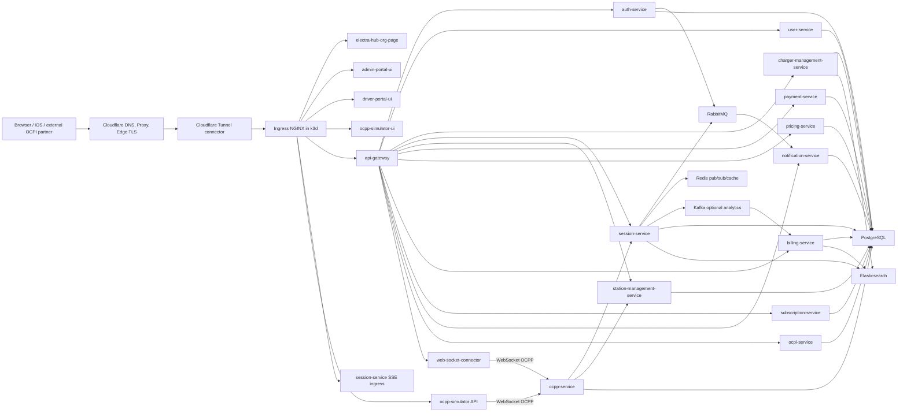
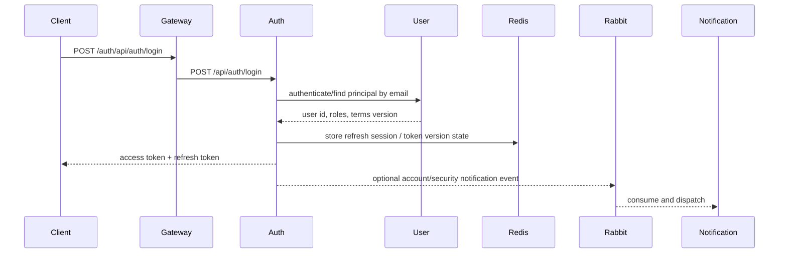
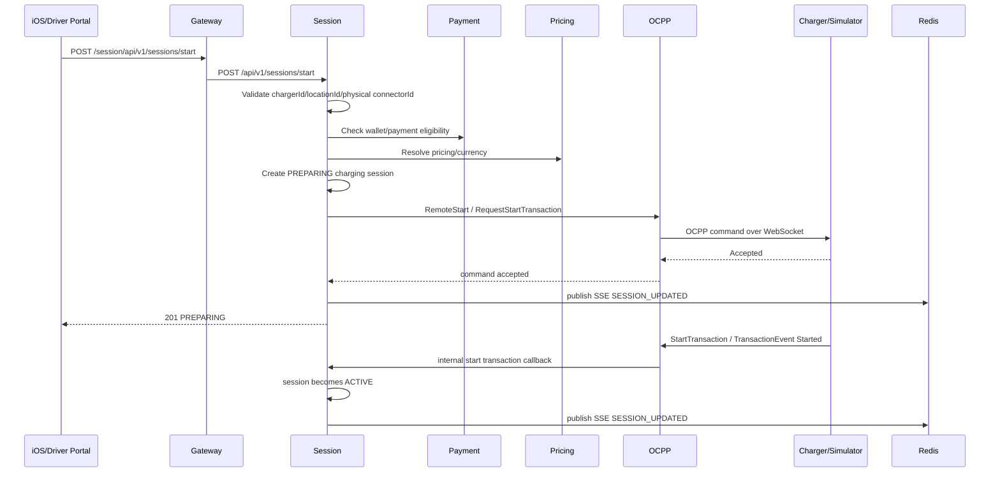
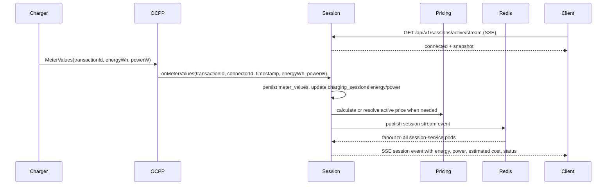
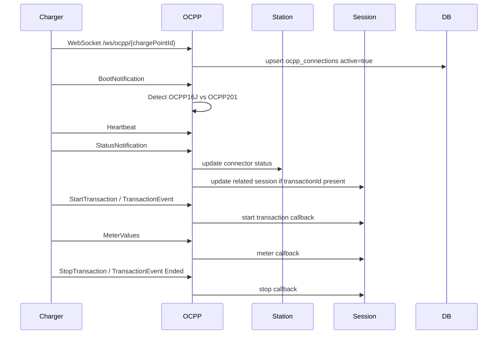

# ElectraHub Application Design Document

Date: 2026-06-18

This document describes the current ElectraHub platform as implemented in the local repositories under `C:\development\project` and deployed through `k8s-platform` to the k3d dev and prod clusters. It covers component responsibilities, external routing, SSL/TLS termination, service communication, SSE, OCPP/OCPI event flow, API surfaces, persistence, and asynchronous messaging.

## 1. Executive Summary

ElectraHub is an EV charging platform composed of independently deployed services behind an API gateway and Cloudflare Tunnel. The platform supports:

- Public web entry points for the org page, driver portal, admin portal, and simulator UI.
- JWT-secured backend APIs routed through `api-gateway`.
- Charger inventory and OCPI-style charger discovery through `charger-management-service`.
- OCPP WebSocket charger connectivity through `ocpp-service`.
- Driver charging sessions, meter values, receipts, and SSE updates through `session-service`.
- Auth, user profile, RBAC, terms acceptance, payment, billing, pricing, subscriptions, and notifications.
- GitOps deployment with Argo CD and Helm from `k8s-platform`.

Current prod runtime is a k3d Kubernetes cluster exposed through Cloudflare Tunnel. Cloudflare terminates public HTTPS at the edge, cloudflared forwards traffic to nginx ingress inside the cluster, and nginx routes to ClusterIP services.

## 2. Runtime Environments

| Environment | Kubernetes context | Namespace | Domain pattern | Sync policy |
|---|---|---:|---|---|
| Dev | `k3d-electrahub-dev` | `dev` | `*.dev.electrahub.net` | Mostly auto/manual Argo sync depending app |
| Prod | `k3d-electrahub-prod` | `prod` | `*.electrahub.net` | Manual Argo sync for controlled rollout |

Prod currently runs these primary images:

| Component | Image |
|---|---|
| `admin-portal-ui` | `amolsurjuse/admin-portal-ui:11` |
| `api-gateway` | `amolsurjuse/api-gateway:16` |
| `auth-service` | `amolsurjuse/auth-service:5` |
| `billing-service` | `amolsurjuse/billing-service:11` |
| `charger-management-service` | `amolsurjuse/charger-management-service:6` |
| `driver-portal-ui` | `amolsurjuse/driver-portal-frontend:10` |
| `electra-hub-org-page` | `amolsurjuse/electra-hub-org-page:6` |
| `notification-service` | `amolsurjuse/notification-service:5` |
| `ocpi-service` | `amolsurjuse/ocpi-service:5` |
| `ocpp-service` | `amolsurjuse/ocpp-service:7` |
| `ocpp-simulator` | `amolsurjuse/ocpi-simulator:9` |
| `ocpp-simulator-ui` | `amolsurjuse/ocpi-simulator-ui:2` |
| `payment-service` | `amolsurjuse/payment-service:4` |
| `pricing-service` | `amolsurjuse/pricing-service:9` |
| `session-service` | `amolsurjuse/session-service:10` |
| `station-management-service` | `amolsurjuse/station-management-service:5` |
| `subscription-service` | `amolsurjuse/subscription-service:3` |
| `user-service` | `amolsurjuse/user-service:17` |
| `web-socket-connector` | `amolsurjuse/web-socket-connector:8` |

## 3. High-Level Architecture

## 4. External Routing and SSL/TLS

### 4.1 Request Path

Public traffic follows this path:

1. Client requests `https://*.electrahub.net`.
2. Cloudflare DNS points the hostname to the Cloudflare Tunnel CNAME target.
3. Cloudflare edge terminates browser-facing TLS.
4. `cloudflared` creates an outbound tunnel from the Kubernetes cluster to Cloudflare.
5. Cloudflare forwards HTTP traffic through the tunnel to `ingress-nginx-controller`.
6. nginx ingress selects a backend service by host/path.
7. Service receives HTTP inside the cluster.

### 4.2 SSL Termination

Current ingress manifests include TLS sections with `electrahub-prod-tls`, but nginx annotations set:

- `nginx.ingress.kubernetes.io/ssl-redirect: "false"`
- `nginx.ingress.kubernetes.io/force-ssl-redirect: "false"`

This means public SSL is primarily terminated at Cloudflare. Inside the Cloudflare Tunnel and Kubernetes cluster, traffic is HTTP to nginx and then HTTP to services. The browser still sees HTTPS because the Cloudflare edge certificate protects the public side.

Recommended future hardening:

- Keep Cloudflare public TLS enabled.
- Decide whether to enable origin TLS from Cloudflare Tunnel to nginx using internal certificates.
- Enable strict TLS mode only after origin certs are correctly installed.
- Keep service-to-service traffic internal-only over ClusterIP.

### 4.3 Prod Ingress Hosts

| Host | Ingress target | Purpose |
|---|---|---|
| `electrahub.net` | `electra-hub-org-page` | Main public org page |
| `www.electrahub.net` | `electra-hub-org-page` | Public org page alias |
| `api.electrahub.net` | `api-gateway` | Main REST/GraphQL API gateway |
| `api.electrahub.net/session/api/v1/sessions/active/stream` | `session-service` direct ingress | SSE bypass route with streaming-safe nginx settings |
| `admin-portal.electrahub.net` | `admin-portal-ui` | Admin UI |
| `driver-portal.electrahub.net` | `driver-portal-ui` | Driver portal UI |
| `ocpp-simulator.electrahub.net` | `ocpp-simulator` and `ocpp-simulator-ui` | Simulator API/UI |

SSE uses a dedicated ingress because streaming needs long read/send timeouts and buffering disabled:

- `proxy-buffering: "off"`
- `proxy-request-buffering: "off"`
- `proxy-http-version: "1.1"`
- `proxy-read-timeout: "3600"`
- `proxy-send-timeout: "3600"`

## 5. API Gateway and Security

`api-gateway` is the public backend entry point for most REST and GraphQL traffic.

### 5.1 Path Routing

Gateway route prefixes:

| Public prefix | Backend service |
|---|---|
| `/auth/**` | `auth-service:8080` |
| `/user/**`, `/terms/**`, `/admin/**` | `user-service:8082` |
| `/subscription/**` | `subscription-service:8086` |
| `/payment/**` | `payment-service:8083` |
| `/billing/**` | `billing-service:8085` |
| `/charger/**`, `/charger-management/**` | `charger-management-service:8086` |
| `/pricing/**` | `pricing-service:8092` |
| `/session/**` | `session-service:8083` |
| `/station/**` | `station-management-service:8081` |
| `/notifications/**` | `notification-service:8085` |
| `/ws/**` | `web-socket-connector:8091` |

The gateway strips the first path prefix and proxies to the internal service. Example:

`https://api.electrahub.net/session/api/v1/sessions/start`

routes to:

`http://session-service:8083/api/v1/sessions/start`

### 5.2 Authentication and RBAC

The gateway validates JWTs using:

- issuer: `auth-service`
- shared JWT secret from configuration
- Redis token denylist prefix: `deny:jwt:`
- Redis token version prefix: `tv:`

RBAC is policy driven:

- Gateway has local rule defaults in `api-gateway/application.yaml`.
- Gateway can fetch remote RBAC policy from `user-service` at `/api/internal/rbac/policy`.
- RBAC default decision is `DENY`.
- RBAC failures should return `403 Forbidden`, not `401 Unauthorized`.
- `401 Unauthorized` is reserved for missing/invalid authentication.

Terms acceptance is enforced by gateway terms filters. Tokens include a terms version claim (`tv`). If `tv` is lower than the current terms version, terms-gated services should return `451 TERMS_ACCEPTANCE_REQUIRED` unless the request is for terms acceptance or an allowed public endpoint.

## 6. Component Responsibilities

| Component | Responsibility |
|---|---|
| `electra-hub-org-page` | Public marketing/org entry page and links to portals |
| `admin-portal-ui` | Admin operations UI |
| `driver-portal-ui` | Driver-facing web portal |
| iOS app | Driver mobile client |
| `api-gateway` | Public API routing, JWT validation, RBAC, CORS, HTTP logging, route forwarding |
| `auth-service` | Login, registration, refresh tokens, password reset, JWT issuance |
| `user-service` | User profile, roles, RBAC policy, terms versions/acceptance, internal principal lookup |
| `station-management-service` | Station/location/EVSE/connector domain model |
| `charger-management-service` | Charger inventory, admin charger hierarchy, GraphQL charger discovery, Elasticsearch connector index |
| `ocpp-service` | OCPP WebSocket endpoint, charger connection state, OCPP message routing, remote commands |
| `web-socket-connector` | Simulated/managed outbound OCPP WebSocket client for chargers |
| `ocpp-simulator` | Simulator API and OCPP charger behavior |
| `ocpp-simulator-ui` | Simulator UI |
| `session-service` | Driver charging sessions, remote start/stop orchestration, meter values, SSE, receipts |
| `pricing-service` | Pricing plans, tariff calculation, historical pricing/signals |
| `payment-service` | Wallet, cards, top-ups, payment state, session settlement |
| `billing-service` | Tariffs, CDRs, invoices, billing payments, analytics |
| `ocpi-service` | OCPI 2.2.1 endpoints, credentials, locations, sessions, CDRs, tariffs, commands |
| `subscription-service` | Subscription plans, allocations, utilization, audit |
| `notification-service` | Notification inbox, contacts, RabbitMQ event consumption, email/push dispatch |
| PostgreSQL | Persistent relational data |
| Redis | JWT/session caches, token denylist/versioning, SSE pub/sub, optional service caches |
| RabbitMQ | Notification domain events and dispatch commands |
| Kafka | Optional analytics event stream from session to billing |
| Elasticsearch | Search/analytics indexes for connector/session/billing data |
| Argo CD | GitOps application sync |

### 6.1 Service Communication Matrix

| Source | Destination | Protocol | Purpose | Notes |
|---|---|---|---|---|
| Browser/iOS | Cloudflare edge | HTTPS | Public UI/API entry | Public TLS terminates at Cloudflare |
| Cloudflare Tunnel | nginx ingress | HTTP inside tunnel | Routes public host/path traffic into k3d | `cloudflared` maintains outbound tunnel connectors |
| nginx ingress | UI services | HTTP | Serves org page, admin portal, driver portal, simulator UI | Static/containerized web frontends |
| nginx ingress | `api-gateway` | HTTP | Main backend API entry | Host `api.electrahub.net` / `api.dev.electrahub.net` |
| nginx ingress | `session-service` | HTTP/SSE | Direct SSE stream route | Bypasses gateway for long-lived `/api/v1/sessions/active/stream` |
| `api-gateway` | backend services | HTTP | Path-based proxying after auth/RBAC/terms checks | Preserves `Authorization` and request context headers |
| `auth-service` | `user-service` | HTTP/internal client | Principal lookup, password update, roles, terms version | Login and reset-password flows depend on this |
| `auth-service` | Redis | Redis | Refresh/session token state, reset tokens, denylist/versioning | Used during login, refresh, logout, password reset |
| `auth-service` | RabbitMQ | AMQP | Account/security notification events | Consumed by `notification-service` |
| `user-service` | PostgreSQL | JDBC | User, role, terms, preferences persistence | Source of identity/RBAC truth |
| `session-service` | `payment-service` | HTTP | Wallet/payment state and session settlement | Start/stop charging flows |
| `session-service` | `pricing-service` | HTTP | Estimate and real-time charging cost | Meter values drive cost updates |
| `session-service` | `ocpp-service` | HTTP | Remote start/stop commands | Uses OCPP charger identity, not OCPI location id |
| `session-service` | Redis | Redis pub/sub/cache | SSE fan-out and recent receipt cache | Channel `session-service:driver-session-stream` |
| `session-service` | RabbitMQ | AMQP | Charging notification events | Start, stop, receipt, idle, full battery events |
| `session-service` | Kafka | Kafka producer | Optional analytics receipt stream | Topic `eh.charging.receipt.generated.v1` |
| `billing-service` | Kafka | Kafka consumer | Optional receipt/CDR analytics ingestion | Consumer group owned by billing |
| `ocpp-service` | chargers/simulator | WebSocket/OCPP JSON | Boot, heartbeat, status, transactions, meter values | Publicly exposed through ingress WebSocket path |
| `ocpp-service` | `session-service` | HTTP/internal callbacks | Transaction and meter-value updates | Bridges OCPP events into driver session state |
| `ocpp-service` | `station-management-service` | HTTP/internal callbacks | Charger/connector availability updates | Keeps station inventory in sync |
| `charger-management-service` | PostgreSQL/Elasticsearch | JDBC/HTTP | Charger inventory and search documents | GraphQL discovery reads charger/location/pricing view |
| `ocpi-service` | PostgreSQL/services | HTTP/JDBC | OCPI credentials, locations, tariffs, sessions, CDRs | OCPI-facing compatibility layer |
| `notification-service` | RabbitMQ | AMQP | Consume domain and dispatch events | Exchange `notifications.events` |
| `notification-service` | Firebase/SMTP | HTTPS/SMTP | Push/email delivery | Email disabled by default unless configured |

## 7. Critical End-to-End Flows

### 7.1 Login Flow

### 7.2 Password Reset Flow

1. Client calls `POST /auth/api/auth/forgot-password`.
2. `auth-service` looks up user principal through `user-service`.
3. `auth-service` creates reset token in Redis under password-reset prefix.
4. `auth-service` publishes `USER_PASSWORD_RESET_REQUESTED` to RabbitMQ.
5. `notification-service` sends email if email channel is enabled and quota allows.
6. Driver portal receives reset token URL and calls `POST /auth/api/auth/reset-password`.
7. `auth-service` validates Redis token, updates password through `user-service` internal endpoint, deletes token, publishes `USER_PASSWORD_CHANGED`.

### 7.3 Driver Start Charging Flow

Protocol mapping rules:

- `chargerId` must be the OCPP charge point identity, for example `EH-SFO-CHG-001`.
- `locationId` must be the OCPI location id, for example `US*EHB*LOC*SFO001`.
- `connectorId` must be the physical connector id, for example `CON-SFO-001`.
- `connectorNumber` is the OCPP connector/EVSE number, for example `1`.
- `CON-TARIFF-*` values are pricing metadata and are rejected by `session-service`.

### 7.4 Meter Values and Real-Time Cost Flow

`MeterValuesHandler` extracts:

- `connectorId`
- `transactionId`
- timestamp from top-level or first `meterValue[].timestamp`
- `Energy.Active.Import.Register`
- `Power.Active.Import`

### 7.5 Stop Charging and Receipt Flow

1. Client calls `POST /session/api/v1/sessions/{id}/stop`.
2. `session-service` validates ownership.
3. `session-service` calls `ocpp-service` remote stop if there is an OCPP transaction id.
4. Charger sends `StopTransaction` or OCPP 2.0.1 transaction-ended event.
5. `ocpp-service` sends stop callback to `session-service`.
6. `session-service` marks terminal state, calculates final energy/cost, settles payment.
7. `session-service` publishes SSE receipt events:
   - `RECEIPT_PREPARING`
   - `RECEIPT_READY`
   - `RECEIPT_TIMEOUT`
8. `session-service` may publish Kafka analytics event if Kafka is enabled.
9. `billing-service` consumes analytics event and creates/updates charging session fact rows.
10. `notification-service` may send `CHARGING_RECEIPT_READY` email through RabbitMQ notification flow.

### 7.6 OCPP Charger Connection Flow

OCPP WebSocket endpoint:

- Internal path: `/ws/ocpp/{chargePointId}`
- Service: `ocpp-service:8082`
- OCPP 1.6 remote start action: `RemoteStartTransaction`
- OCPP 2.0.1 remote start action: `RequestStartTransaction`
- OCPP 1.6 remote stop action: `RemoteStopTransaction`
- OCPP 2.0.1 remote stop action: `RequestStopTransaction`

### 7.7 OCPI Flow

`ocpi-service` exposes OCPI 2.2.1 CPO/eMSP endpoints and stores partner credentials, tokens, locations, sessions, CDRs, tariffs, and sync queue items.

Typical OCPI read flow:

1. eMSP calls `/ocpi/2.2.1/cpo/locations`, `/sessions`, `/cdrs`, or `/tariffs`.
2. `ocpi-service` authenticates OCPI token.
3. `ocpi-service` serves data from OCPI tables or sync projections.

Typical OCPI command flow:

1. eMSP calls `/ocpi/2.2.1/emsp/commands/START_SESSION`.
2. `ocpi-service` translates the command to internal session/OCPP flow.
3. Internal command result is returned as OCPI command response.

`charger-management-service` also exposes GraphQL charger discovery for the driver app and admin portal. This is separate from the OCPI partner API but uses OCPI-like location/EVSE/connector concepts.

## 8. SSE Design

SSE is implemented in `session-service`.

### 8.1 Endpoint

External:

`GET https://api.electrahub.net/session/api/v1/sessions/active/stream`

Internal:

`GET http://session-service:8083/api/v1/sessions/active/stream`

### 8.2 Server Implementation

`DriverSessionStreamService`:

- Keeps local emitters in `emittersByAccountId`.
- Uses `SseEmitter` timeout of 30 minutes.
- Sends `connected` immediately.
- Sends `snapshot` after subscription with current active sessions.
- Sends heartbeat every 15 seconds.
- Publishes cross-pod events using Redis pub/sub channel `session-service:driver-session-stream`.
- Caches terminal receipt events for 120 seconds at key:
  `session-service:driver-session-stream:last-receipt:{accountId}`.

### 8.3 Event Types

| SSE event name | Payload type |
|---|---|
| `connected` | `CONNECTED` |
| `snapshot` | `SNAPSHOT` with active sessions |
| `heartbeat` | `HEARTBEAT` |
| `session` | `SESSION_UPDATED` |
| `terminal` | `SESSION_TERMINAL` |
| `receipt-preparing` | `RECEIPT_PREPARING` |
| `receipt-ready` | `RECEIPT_READY` |
| `receipt-timeout` | `RECEIPT_TIMEOUT` |

### 8.4 Client Behavior

The client should:

- Open SSE after start request or app foreground.
- Treat `snapshot` as authoritative current state.
- Update charging UI on `session` events.
- Close or move to receipt UI on terminal or receipt events.
- Reconnect after network loss.
- Continue polling `/active` as fallback if SSE is unavailable.

## 9. Messaging and Eventing

### 9.1 RabbitMQ Notification Events

RabbitMQ is currently the main domain-event bus for notifications.

Exchange:

`notifications.events`

Routing keys:

| Routing key | Purpose |
|---|---|
| `notifications.domain` | Domain events from auth/session/etc. to notification-service |
| `notifications.dispatch` | Internal async dispatch command queue |

Queues:

| Queue | Consumer |
|---|---|
| domain event queue from `notification.broker.domain-event-queue` | `DomainNotificationEventListener` |
| dispatch queue from `notification.broker.dispatch-queue` | `NotificationDispatchListener` |

Consumers use `defaultRequeueRejected(false)`, so failed listener messages are not automatically retried forever.

Domain event producers:

- `auth-service`: account created, password reset requested, password changed.
- `session-service`: charging session started/stopped/receipt events.
- Future producers can publish the same event envelope to RabbitMQ.

Event envelope:

| Field | Meaning |
|---|---|
| `eventId` | unique event id |
| `eventType` | domain event type |
| `tenantId` | currently `electrahub` |
| `recipientRef` | user/contact target |
| `userId` | user id when known |
| `occurredAt` | event timestamp |
| `payload` | event-specific attributes |

Notification channel mapping:

| Event | Channels |
|---|---|
| `USER_ACCOUNT_CREATED` | email, push |
| `USER_PASSWORD_CHANGED` | email, push |
| `USER_PASSWORD_RESET_REQUESTED` | email |
| `CHARGING_SESSION_STARTED` | push |
| `CHARGING_SESSION_STOPPED` | push |
| `CHARGING_BATTERY_FULL` | push |
| `CHARGING_IDLE_WARNING` | push |
| `CHARGING_IDLE_STARTED` | push |
| `PAYMENT_RECEIPT_READY` | email |
| `CHARGING_RECEIPT_READY` | email |
| `SUPPORT_CONTACT_CREATED` | email |
| `SUPPORT_ESCALATION_CREATED` | email |

Email sending is intentionally conservative:

- real send disabled by default
- rate limit defaults to 1 msg/sec
- daily cap defaults to 59/day in config unless overridden
- retry disabled
- failures are recorded/ignored without retry loops
- rolling 24-hour quota window is enforced by counting attempted sends

Push uses Firebase Cloud Messaging when configured:

- disabled by default
- Firebase service account can come from path, JSON, or base64
- daily and per-second quotas are enforced
- failures are recorded and ignored without retry

### 9.2 Kafka Analytics Events

Kafka is optional and feature-flagged.

Producer:

- `session-service`
- `ReceiptAnalyticsEventPublisher`
- enabled by `app.analytics.kafka.enabled=true`
- topic default: `eh.charging.receipt.generated.v1`

Consumer:

- `billing-service`
- `ReceiptAnalyticsEventConsumer`
- enabled by `app.analytics.kafka.enabled=true`
- group default: `billing-service-analytics-v1`

Purpose:

- Turn charging receipt events into billing analytics facts.
- Populate `charging_session_facts`, KPI daily/monthly tables, and analytics indexes.

If Kafka is disabled, the core charging flow still works. Analytics ingestion must be performed through direct service jobs/reindexing or enabled later.

### 9.3 Redis Usage

| Service | Redis purpose |
|---|---|
| `api-gateway` | token denylist/version checks |
| `auth-service` | refresh sessions, token denylist/version, password reset tokens |
| `session-service` | SSE pub/sub fanout and receipt replay cache |
| `station-management-service` | cache/support configuration |
| `billing-service` | Redis publish/cache support |
| `ocpp-service` | cache/support configuration |
| `ocpi-service` | cache/support configuration |

## 10. API Surface by Service

External APIs usually pass through `api-gateway` with the service prefix. The paths below are internal service paths; add the gateway prefix when calling externally.

### 10.1 `auth-service`

Base path: `/api/auth`

| Method | Path | Purpose |
|---|---|---|
| POST | `/oauth/google` | Google OIDC login |
| POST | `/register` | User registration |
| POST | `/login` | Login and JWT issuance |
| POST | `/forgot-password` | Create reset token and notification event |
| POST | `/reset-password` | Reset password by token |
| POST | `/refresh` | Refresh access token |
| POST | `/logout-device` | Revoke current device refresh token |
| POST | `/logout-all` | Revoke all refresh tokens |

Country lookup:

| Method | Path | Purpose |
|---|---|---|
| GET | `/api/countries` | Country list |

### 10.2 `user-service`

| Method | Path | Purpose |
|---|---|---|
| GET | `/api/v1/users/{userId}/principal` | User principal |
| GET | `/api/v1/users/{userId}/profile` | User profile |
| PUT | `/api/v1/users/{userId}/profile` | Update profile |
| GET | `/api/v1/users` | Search/list users |
| GET | `/api/v1/users/search/count` | Count users |
| POST | `/api/v1/users` | Register user |
| POST | `/api/v1/users/authenticate` | Authenticate user |
| GET | `/api/v1/countries` | Country list |
| GET | `/api/v1/terms/current` | Current terms |
| GET | `/api/v1/terms/status` | Terms acceptance status |
| POST | `/api/v1/terms/accept` | Accept terms |
| GET | `/api/v1/terms/history` | Terms history |
| GET | `/api/v1/terms` | Admin terms list |
| POST | `/api/v1/terms` | Create terms version |
| PUT | `/api/v1/terms/{id}/activate` | Activate terms version |
| GET | `/api/v1/terms/{id}/acceptances` | Terms acceptances |
| GET | `/api/v1/admin/users` | Admin user list |
| GET | `/api/v1/admin/users/{userId}` | Admin user detail |
| PUT | `/api/v1/admin/users/{userId}` | Admin update user |
| POST | `/api/v1/admin/users/{userId}/reset-password` | Admin reset password |
| DELETE | `/api/v1/admin/users/{userId}` | Admin delete user |
| GET | `/api/v1/admin/rbac/policy` | Admin RBAC policy |
| PUT | `/api/v1/admin/rbac/policy` | Update RBAC policy |
| GET | `/api/internal/rbac/policy` | Gateway policy source |
| GET | `/api/internal/terms/gate-status` | Terms gate status |
| POST | `/api/internal/users/{userId}/password/reset` | Internal password reset |
| GET | `/api/internal/users/by-email/{email}/principal` | Internal principal lookup |

### 10.3 `charger-management-service`

Admin base: `/api/v1/admin`

| Method | Path | Purpose |
|---|---|---|
| GET | `/enterprises` | List enterprises |
| POST | `/enterprises` | Create enterprise |
| GET | `/networks` | List networks |
| POST | `/networks` | Create network |
| GET | `/locations` | List locations |
| POST | `/locations` | Create location |
| GET | `/chargers` | List chargers |
| GET | `/chargers/connectors` | Charger/EVSE/connector hierarchy |
| POST | `/chargers` | Create charger |
| GET | `/evses` | List EVSEs |
| POST | `/evses` | Create EVSE |
| GET | `/connectors` | List connectors |
| POST | `/connectors` | Create connector |
| POST | `/connectors/search/reindex` | Reindex connector search |
| POST | `/connectors/search/sync/{connectorId}` | Sync one connector to search |
| POST | `/connectors/search/sync/evse/{evseId}` | Sync EVSE connectors |
| POST | `/connectors/search/sync/charger/{chargerId}` | Sync charger connectors |

Charger base: `/api/v1/chargers`

| Method | Path | Purpose |
|---|---|---|
| POST | `/` | Create charger |
| GET | `/` | List chargers |
| GET | `/{chargerId}` | Get charger |
| GET | `/{chargerId}/settings` | Charger settings |
| PUT | `/{chargerId}` | Update charger |
| PATCH | `/{chargerId}/status` | Update status |
| DELETE | `/{chargerId}` | Delete charger |

GraphQL:

| Path | Purpose |
|---|---|
| `/graphql` | Charger discovery, OCPI-like charger/EVSE/connector graph, tariffs, active session overlay |

Important data contract:

- Physical connector ids are values like `CON-SFO-001`.
- Tariff ids are values like `CON-TARIFF-009` and must not be used as physical connector ids.

### 10.4 `session-service`

Base: `/api/v1/sessions`

| Method | Path | Purpose |
|---|---|---|
| POST | `/` | Create session record |
| POST | `/start` | Driver remote start |
| POST | `/{id}/stop` | Driver stop |
| GET | `/active` | Active sessions for account |
| GET | `/{id}/current` | Current session details |
| GET | `/active/stream` | SSE active session stream |
| GET | `/internal/active-by-chargers` | Active sessions for charger ids |
| GET | `/history` | Driver session history |
| GET | `/dashboard-stats` | Driver dashboard stats |

Additional controllers include:

- authorization APIs
- driver APIs
- id token APIs
- meter value APIs
- admin dashboard stats recompute APIs

### 10.5 `ocpp-service`

WebSocket:

| Path | Purpose |
|---|---|
| `/ws/ocpp/{chargePointId}` | OCPP charge point WebSocket |

REST:

| Method | Path | Purpose |
|---|---|---|
| GET | `/api/v1/ocpp/connections` | List active/history connections |
| GET | `/api/v1/ocpp/connections/{chargePointId}` | Connection detail |
| GET | `/api/v1/ocpp/connections/count` | Connection count |
| GET | `/api/v1/ocpp/stats/messages` | Message stats |
| GET | `/api/v1/ocpp/stats/connections/history` | Connection history stats |
| POST | `/api/v1/ocpp/commands/{chargePointId}/remote-start` | Remote start |
| POST | `/api/v1/ocpp/commands/{chargePointId}/remote-stop` | Remote stop |
| POST | `/api/v1/ocpp/commands/{chargePointId}/reset` | Reset charger |
| POST | `/api/v1/ocpp/commands/{chargePointId}/unlock-connector` | Unlock connector |
| POST | `/api/v1/ocpp/commands/{chargePointId}/set-charging-profile` | Set charging profile |
| POST | `/api/v1/ocpp/commands/{chargePointId}/change-configuration` | Change config |
| POST | `/api/v1/ocpp/commands/{chargePointId}/get-configuration` | Get config |
| POST | `/api/v1/ocpp/commands/{chargePointId}/trigger-message` | Trigger OCPP message |

### 10.6 `station-management-service`

| Base path | Operations |
|---|---|
| `/api/v1/organizations` | create/list/get/update/delete organizations |
| `/api/v1/locations` | create/list/get/update/list by organization |
| `/api/v1/stations` | register/list/get/by charge point/by location/online/heartbeat/status/firmware/registration |
| `/api/v1/evses` | create/list/get/by station/status |
| `/api/v1/connectors` | create/list/get/by EVSE/by status/update status |
| `/api/v1/charging-profiles` | create/list/get/by station/delete |

### 10.7 `payment-service`

| Method | Path | Purpose |
|---|---|---|
| GET | `/api/v1/payment/state` | Payment state |
| GET | `/api/v1/payment/wallet` | Wallet state |
| GET | `/api/v1/payment/wallet/topups` | Top-up history |
| GET | `/api/v1/payment/session-transactions` | Session payment transactions |
| POST | `/api/v1/payment/reload` | Reload wallet |
| GET | `/api/v1/payment/cards` | Cards |
| POST | `/api/v1/payment/cards` | Add card |
| DELETE | `/api/v1/payment/cards/{cardId}` | Delete card |
| GET | `/api/v1/payment/auto-topup` | Auto top-up config |
| PUT | `/api/v1/payment/auto-topup` | Update auto top-up |
| POST | `/api/v1/payment/wallet/topups` | Create top-up |
| POST | `/api/v1/payment/internal/accounts` | Internal wallet provisioning |
| POST | `/api/v1/payment/internal/session-settlements` | Internal session settlement |

### 10.8 `pricing-service`

| Method | Path | Purpose |
|---|---|---|
| GET | `/api/v1/pricing/health` | Pricing service health |
| POST | `/api/v1/pricing/plans` | Create pricing plan |
| GET | `/api/v1/pricing/plans/{planId}` | Pricing plan detail |
| GET | `/api/v1/pricing/plans` | List/search pricing plans |
| GET | `/api/v1/pricing/plans/paged` | Paged pricing plan list |
| GET | `/api/v1/pricing/plans/location/{locationId}` | Pricing plans for location |
| GET | `/api/v1/pricing/plans/applicable` | Find applicable plan by location/connector/context |
| PUT | `/api/v1/pricing/plans/{planId}` | Update pricing plan |
| DELETE | `/api/v1/pricing/plans/{planId}` | Delete pricing plan |
| POST | `/api/v1/pricing/plans/search/reindex` | Rebuild pricing search index |
| POST | `/api/v1/pricing/plans/search/sync/{planId}` | Sync one plan to search |
| POST | `/api/v1/pricing/calculate/session-cost` | Calculate completed/in-progress session cost |
| POST | `/api/v1/pricing/calculate/estimate` | Estimate cost before charging |
| POST | `/api/v1/pricing/calculate/realtime` | Calculate real-time cost from meter values |
| GET | `/api/v1/pricing/history/plan/{planId}` | Price history by plan |
| GET | `/api/v1/pricing/history/location/{locationId}` | Price history by location |
| POST | `/api/v1/pricing/signals` | Create price signal |
| GET | `/api/v1/pricing/signals/location/{locationId}` | Price signals for location |
| GET | `/api/v1/pricing/signals/location/{locationId}/latest` | Latest price signal for location |
| GET | `/api/v1/pricing/ocpi/tariffs` | OCPI tariff list |
| GET | `/api/v1/pricing/ocpi/tariffs/{planId}` | OCPI tariff by plan |
| POST | `/api/v1/pricing/ocpi/tariffs/import` | Import OCPI tariff |

### 10.9 `billing-service`

| Method | Path | Purpose |
|---|---|---|
| POST | `/api/v1/billing/cdrs/generate/{sessionId}` | Generate CDR |
| GET | `/api/v1/billing/cdrs/{cdrId}` | CDR detail |
| GET | `/api/v1/billing/cdrs` | CDR list/filter |
| GET | `/api/v1/billing/cdrs/session/{sessionId}` | CDR by session |
| PUT | `/api/v1/billing/cdrs/{cdrId}/status` | Update CDR status |
| POST | `/api/v1/billing/invoices` | Create invoice |
| GET | `/api/v1/billing/invoices/{invoiceId}` | Invoice detail |
| GET | `/api/v1/billing/invoices/driver/{driverId}` | Driver invoices |
| PUT | `/api/v1/billing/invoices/{invoiceId}/paid` | Mark paid |
| POST | `/api/v1/billing/invoices/{invoiceId}/issue` | Issue invoice |
| POST | `/api/v1/billing/payments` | Create billing payment |
| GET | `/api/v1/billing/payments/invoice/{invoiceId}` | Payments by invoice |
| POST | `/api/v1/billing/payments/{transactionId}/refund` | Refund |
| POST | `/api/v1/billing/tariffs` | Create tariff |
| GET | `/api/v1/billing/tariffs/{tariffId}` | Tariff detail |
| GET | `/api/v1/billing/tariffs` | Tariff list |
| GET | `/api/v1/billing/tariffs/location/{locationId}` | Tariffs by location |
| PUT | `/api/v1/billing/tariffs/{tariffId}` | Update tariff |
| DELETE | `/api/v1/billing/tariffs/{tariffId}` | Delete tariff |

Admin analytics base: `/api/v1/admin/analytics`

Includes overview, revenue trend, energy trend, session trend, connector status summary, revenue by location, duration distribution, peak hours, utilization trend, users, user sessions, reindex, reports, and report download.

### 10.10 `ocpi-service`

OCPI 2.2.1:

| Method | Path | Purpose |
|---|---|---|
| GET | `/ocpi/versions` | OCPI versions |
| GET | `/ocpi/2.2.1` | Version details |
| POST/PUT/DELETE/GET | `/ocpi/2.2.1/credentials` | Credentials handshake |
| GET | `/ocpi/2.2.1/cpo/locations` | Locations |
| GET | `/ocpi/2.2.1/cpo/locations/{locationId}` | Location |
| GET | `/ocpi/2.2.1/cpo/locations/{locationId}/{evseUid}` | EVSE |
| GET | `/ocpi/2.2.1/cpo/locations/{locationId}/{evseUid}/{connectorId}` | Connector |
| GET | `/ocpi/2.2.1/cpo/sessions` | Sessions |
| GET | `/ocpi/2.2.1/cpo/sessions/{sessionId}` | Session |
| GET | `/ocpi/2.2.1/cpo/cdrs` | CDRs |
| GET | `/ocpi/2.2.1/cpo/cdrs/{cdrId}` | CDR |
| GET | `/ocpi/2.2.1/cpo/tariffs` | Tariffs |
| GET | `/ocpi/2.2.1/cpo/tariffs/{tariffId}` | Tariff |
| GET | `/ocpi/2.2.1/emsp/tokens` | Tokens |
| GET | `/ocpi/2.2.1/emsp/tokens/{tokenUid}` | Token |
| POST | `/ocpi/2.2.1/emsp/tokens/{tokenUid}/authorize` | Token authorize |
| PUT | `/ocpi/2.2.1/emsp/tokens/{countryCode}/{partyId}/{tokenUid}` | Upsert token |
| POST | `/ocpi/2.2.1/emsp/commands/START_SESSION` | Start command |
| POST | `/ocpi/2.2.1/emsp/commands/STOP_SESSION` | Stop command |
| POST | `/ocpi/2.2.1/emsp/commands/RESERVE_NOW` | Reserve |
| POST | `/ocpi/2.2.1/emsp/commands/CANCEL_RESERVATION` | Cancel reservation |
| POST | `/ocpi/2.2.1/emsp/commands/UNLOCK_CONNECTOR` | Unlock connector |

Admin/sync:

| Method | Path | Purpose |
|---|---|---|
| GET | `/api/v1/ocpi/admin/credentials` | Credentials |
| POST | `/api/v1/ocpi/admin/credentials/register` | Register credentials |
| DELETE | `/api/v1/ocpi/admin/credentials/{credentialId}` | Delete credential |
| POST | `/api/v1/ocpi/admin/sync/locations` | Sync locations |
| POST | `/api/v1/ocpi/admin/sync/sessions` | Sync sessions |
| POST | `/api/v1/ocpi/admin/sync/cdrs` | Sync CDRs |
| GET | `/api/v1/ocpi/sync/queue` | Sync queue |
| POST | `/api/v1/ocpi/sync/queue/{itemId}/retry` | Retry queue item |
| DELETE | `/api/v1/ocpi/sync/queue/completed` | Delete completed queue items |
| GET | `/api/v1/ocpi/sync/stats` | Sync stats |

### 10.11 `subscription-service`

| Method | Path | Purpose |
|---|---|---|
| POST | `/api/v1/admin/subscriptions/grants` | Admin grant |
| GET | `/api/v1/health` | Health |
| POST | `/api/v1/subscriptions/allocations` | Create allocation |
| GET | `/api/v1/subscriptions/allocations` | List allocations |
| GET | `/api/v1/subscriptions/allocations/paged` | Paged allocations |
| PATCH | `/api/v1/subscriptions/allocations/{allocationId}/status` | Update allocation status |
| GET | `/api/v1/subscriptions/audit-logs` | Audit logs |
| GET | `/api/v1/subscriptions/audit-logs/paged` | Paged audit logs |
| POST | `/api/v1/subscriptions/plans` | Create plan |
| GET | `/api/v1/subscriptions/plans` | List/search plans |
| GET | `/api/v1/subscriptions/plans/{planId}` | Plan detail |
| PUT | `/api/v1/subscriptions/plans/{planId}` | Update plan |
| POST | `/api/v1/subscriptions/utilizations/preview` | Preview utilization |
| POST | `/api/v1/subscriptions/utilizations` | Record utilization |
| GET | `/api/v1/subscriptions/utilizations` | List utilization |
| GET | `/api/v1/subscriptions/utilizations/paged` | Paged utilization |

### 10.12 `notification-service`

Base: `/api/v1`

| Method | Path | Purpose |
|---|---|---|
| POST | `/notifications` | Create notification |
| GET | `/inbox` | User inbox |
| PATCH | `/inbox/{id}/read` | Mark read |
| POST | `/contacts` | Register contact |
| POST | `/contact` | Contact/support message |

Webhook base:

| Method | Path | Purpose |
|---|---|---|
| POST | `/webhooks/{provider}` | Provider webhook audit |

## 11. Databases and Table Structure

Each service owns its tables. Current local/prod uses one PostgreSQL instance per environment with multiple logical databases:

- `user_db`
- `billing_db`
- `charger_management_db`
- `ocpi_db`
- `ocpp_db`
- `pricing_db`
- `session_db`
- `station_db`
- `subscription_db`
- `appdb` for payment/notification depending configured service

### 11.1 Auth/User Domain

`auth-service` tables:

| Table | Purpose |
|---|---|
| `users` | auth user credentials and identity |
| `roles` | auth roles |
| `user_roles` | user-role join |
| `refresh_tokens` | refresh tokens/device sessions |
| `country` | country reference |
| `address` | address records |
| `oauth_identities` | Google/OIDC identities |

`user-service` tables under `user_mgmt` schema:

| Table | Purpose |
|---|---|
| `users` | profile/users |
| `roles` | domain roles |
| `country` | country reference |
| `address` | addresses |
| `user_roles` | roles by user |
| `rbac_policies` | policy version/root |
| `rbac_policy_rules` | gateway RBAC rules |
| `terms_versions` | legal terms versions |
| `terms_acceptances` | append-only terms acceptance audit |

### 11.2 Station and Charger Domain

`station-management-service` tables:

| Table | Purpose |
|---|---|
| `organizations` | station owner/operator organizations |
| `locations` | physical locations |
| `charging_stations` | stations/charge points |
| `evses` | EVSE units |
| `connectors` | physical connectors |
| `connector_status_history` | connector status audit |
| `charging_profiles` | OCPP charging profiles |

`charger-management-service` tables:

| Table | Purpose |
|---|---|
| `chargers` | charger inventory |
| `enterprises` | enterprise owner hierarchy |
| `networks` | charging networks |
| `locations` | OCPI-style locations |
| `charger_inventory` | charger admin inventory |
| `evse_inventory` | EVSE admin inventory |
| `connector_inventory` | connector admin inventory |

Recent hardening:

- `013-disable-demo-tariff-connectors.yaml` disables `connector_inventory.connector_id LIKE 'CON-TARIFF-%'`.
- These rows are not physical connectors and must not be used for charging.

### 11.3 Session Domain

`session-service` tables:

| Table | Purpose |
|---|---|
| `drivers` | driver records |
| `id_tokens` | OCPP/driver id tokens |
| `charging_sessions` | session lifecycle, status, charger, connector, energy, cost |
| `session_events` | session event audit |
| `authorization_log` | authorization decisions |
| `meter_values` | OCPP meter values |

Key `charging_sessions` fields include:

- `id`
- `driver_id`
- `id_token_id`
- `station_id`
- `connector_id`
- `connector_ref`
- `user_account_id`
- `charger_id`
- `location_id`
- `status`
- `ocpp_transaction_id`
- `meter_start`
- `meter_stop`
- `energy_kwh`
- `total_cost`
- `currency`
- `started_at`
- `stopped_at`
- `stop_reason`

### 11.4 OCPP Domain

`ocpp-service` tables:

| Table | Purpose |
|---|---|
| `ocpp_connections` | active/history WebSocket connections |
| `ocpp_message_log` | OCPP message audit |
| `ocpp_pending_requests` | outstanding command request tracking |

### 11.5 OCPI Domain

`ocpi-service` tables:

| Table | Purpose |
|---|---|
| `ocpi_credentials` | partner credentials |
| `ocpi_tokens` | OCPI tokens |
| `ocpi_locations` | OCPI locations |
| `ocpi_sessions` | OCPI sessions |
| `ocpi_cdrs` | OCPI CDRs |
| `ocpi_tariffs` | OCPI tariffs |
| `ocpi_sync_queue` | async sync queue |

### 11.6 Payment Domain

`payment-service` uses `payment` schema:

| Table | Purpose |
|---|---|
| `wallet_account` | wallet balance/account |
| `payment_card` | saved card references |
| `auto_topup_config` | auto reload config |
| `wallet_topup` | top-up history |
| `payment_outbox_event` | payment outbox events |
| `country_config` | country payment config |
| `country_topup_preset` | preset top-up amounts |
| `payment_session_transaction` | session settlement transactions |

### 11.7 Billing and Analytics

`billing-service` tables:

| Table | Purpose |
|---|---|
| `tariffs` | billing tariffs |
| `cdrs` | charge detail records |
| `invoices` | invoices |
| `invoice_line_items` | invoice lines |
| `payment_transactions` | billing payment transactions |
| `charging_session_facts` | analytics fact table |
| `charging_kpi_daily` | daily aggregate KPIs |
| `charging_kpi_monthly` | monthly aggregate KPIs |
| `charging_user_kpi_daily` | per-user daily KPIs |
| `analytics_report_jobs` | report generation jobs |

### 11.8 Subscription Domain

`subscription-service` uses `subscription_mgmt` schema:

| Table | Purpose |
|---|---|
| `subscription_plans` | plans and entitlements |
| `subscription_allocations` | plan allocations/grants |
| `subscription_utilizations` | usage records |
| `subscription_audit_logs` | audit history |

### 11.9 Notification Domain

`notification-service` uses `notification` schema:

| Table | Purpose |
|---|---|
| `notifications` | notification inbox and dispatch state |
| `user_contacts` | email/push/sms contacts |
| `webhook_events` | provider webhook audit |

## 12. Observability

Most Spring services include:

- Micrometer metrics.
- Prometheus actuator endpoint exposure.
- OpenTelemetry tracing bridge.
- `TraceMdcFilter` for `traceId` and `spanId` in logs.
- `ObservabilityAspect` for service method timings/counters.

Known current issue from earlier work:

- Some logs show blank `traceId`/`spanId` when incoming traffic has no active trace span or propagation is incomplete.
- Logging standard should ensure every request gets a correlation id even when OpenTelemetry span context is absent.

Recommended logging baseline:

- Always log `traceId`, `spanId`, `correlationId`, `userId/accountId` when available, `service`, `env`, `method`, `path`, `status`, `durationMs`.
- Do not log tokens, passwords, payment secrets, or Firebase credentials.
- Ensure file appenders are disabled or write to valid mounted paths in containers; stdout is the Kubernetes primary sink.

## 13. CI/CD and GitOps

Current flow:

1. Source repo commit to `develop`.
2. TeamCity builds service image.
3. Image pushed to Docker Hub as `amolsurjuse/<service>:<tag>`.
4. `k8s-platform/charts/config/services/<service>/us/version/<env>-version.yaml` is updated.
5. Commit to `k8s-platform` `develop`.
6. Argo CD syncs application.
7. Kubernetes rolls deployment.

Prod policy:

- Prod image tag changes are committed but Argo prod should be manually synced.
- This keeps prod artifact promotion explicit.

## 14. Security Notes

Current controls:

- Cloudflare Tunnel avoids inbound router port exposure.
- Public TLS at Cloudflare.
- API JWT authentication at gateway.
- RBAC at gateway, backed by user-service policy.
- Terms gate based on JWT `tv` claim and user-service terms state.
- Redis token denylist and token version checks.
- Internal services are ClusterIP only.

Important gaps/future hardening:

- Add Cloudflare WAF/rate limiting on public API and admin hosts.
- Enable Cloudflare Access for ArgoCD, Grafana, and admin-only tools.
- Consider origin TLS between cloudflared and nginx.
- Lock OCPP WebSocket origin/auth for real chargers.
- Add mTLS or signed internal API headers for sensitive internal endpoints.
- Add network policies between namespaces/services.
- Remove default secrets/passwords from k8s values and use sealed/external secrets.
- Disable full request/response body logging in production or redact sensitive fields.
- Add RabbitMQ DLQ strategy for notifications instead of silent loss where required.
- Add Kafka only when the runtime is actually deployed and monitored.

## 15. Current Known Design Decisions

- k3d is used because this environment is lightweight and runs on a Windows/WSL2 workstation.
- Dev and prod are separate clusters and separate Cloudflare tunnels.
- `api.electrahub.net` is the canonical backend host.
- `session-service` SSE is directly exposed through nginx ingress for streaming reliability.
- OCPP charger IDs and OCPI location IDs are intentionally distinct.
- Tariff IDs must not be used as connector IDs.
- Notification delivery is quota-limited and failure-tolerant by design.
- Kafka analytics is optional/feature-flagged.

## 16. Source of Truth

| Area | Source |
|---|---|
| Deployment topology | `C:\development\project\k8s-platform\argocd\applications` |
| Helm values and image tags | `C:\development\project\k8s-platform\charts\config\services` |
| API gateway routes/RBAC | `C:\development\project\api-gateway\src\main\resources\application.yaml` |
| Service APIs | `*Controller.java` files in each service repo |
| Database schemas | service `src/main/resources/db/changelog` directories |
| OCPP WebSocket | `ocpp-service` `websocket` and `handler` packages |
| Driver SSE | `session-service` `DriverSessionStreamService` and `ChargingSessionController` |
| Notifications | `notification-service` Rabbit config and listener/orchestrator classes |
| Kafka analytics | `session-service` receipt publisher and `billing-service` receipt consumer |

## 17. Open Items to Keep Document Fresh

- Add generated OpenAPI specs per service once `/v3/api-docs` is enabled consistently.
- Add exact columns for every table from live PostgreSQL `information_schema` export.
- Add sequence diagrams for payment settlement, terms acceptance, notification preferences, and admin user management.
- Add Cloudflare Access/WAF policy export.
- Add TeamCity build definitions and artifact promotion rules.
- Add backup/restore runbook and RPO/RTO.
- Add production incident runbook for Cloudflare 1033, Argo degraded apps, OCPP disconnected chargers, and stuck sessions.
