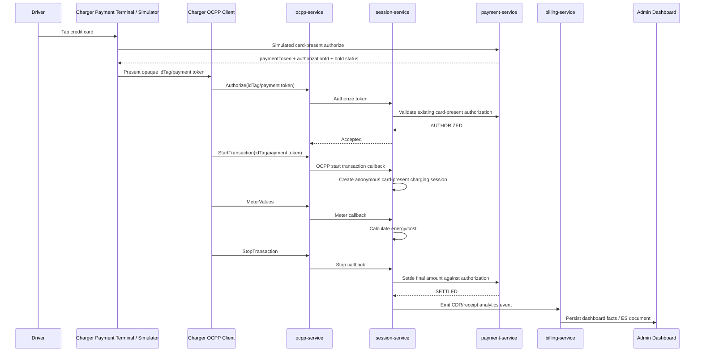

# ElectraHub Card-Present Payment Simulation Design

## Requirement

Support a charger-initiated card-present charging session where the driver taps a physical credit card at the charger/payment terminal instead of using the ElectraHub app. The backend may not know the registered ElectraHub user. For the current simulator-first platform, implement a realistic simulation of card validation, payment authorization hold, session start, meter-based charging, settlement, and reporting.

## Current System Fit

There is no separate `payment-gateway-service` repository today. The owning service is `payment-service`.

Relevant existing capabilities:

- `payment-service` already has internal session authorization and settlement APIs:
  - `/api/v1/payment/internal/session-authorizations`
  - `/api/v1/payment/internal/session-settlements`
- `payment-service` already persists authorization holds and session payment transactions.
- `session-service` already has:
  - `AuthMethod.CREDIT_CARD`
  - `IdTokenType` support for OCPP-style authorization tokens
  - OCPP callback endpoints for start, meter values, and stop
- `ocpp-service` already handles `Authorize`, `StartTransaction`, `MeterValues`, `StopTransaction`, and OCPP 2.0.1 `TransactionEvent`.
- `ocpi-simulator` already supports controlled transactions, Plug & Charge-like flows, DMS/meter events, and synthetic charger behavior.

Conclusion: implement this as a `payment-service` provider-adapter capability first, not as a new microservice. A future `payment-gateway-service` can be extracted later if real processors or multiple acquirer integrations justify it.

## Design Goals

- Support anonymous card-present sessions without a known ElectraHub user.
- Keep PCI-sensitive data out of ElectraHub systems.
- Simulate card brand/Luhn/expiry/CVV/postal checks for dev/prod-demo.
- Simulate third-party payment authorization hold and settlement.
- Preserve OCPP semantics: charger authorizes first, then starts transaction.
- Preserve session correctness: connector concurrency, meter/cost movement, stop reconciliation, CDR generation, dashboard reporting.
- Keep the implementation swappable for a real payment terminal provider such as Payter later.

## Non-Goals

- Do not store PAN, CVV, track data, EMV cryptograms, or raw terminal payloads.
- Do not build real PCI-DSS card processing.
- Do not charge real cards.
- Do not identify a real customer account unless a later receipt-claim flow is added.

## Proposed Architecture



## Payment Provider Model

Introduce a provider abstraction inside `payment-service`:

```text
PaymentProviderAdapter
  authorizeCardPresent(request) -> authorization
  capture(request) -> settlement
  voidOrRelease(request) -> release
  status(providerReference) -> provider state
```

Initial adapter:

```text
DummyCardPresentProviderAdapter
```

Future adapter:

```text
PayterProviderAdapter
```

The domain API should not mention Payter in table names or session contracts. Use neutral names such as `CARD_PRESENT`, `provider`, `terminalId`, and `providerReference`.

## Dummy Card Validation

For simulation, validate only synthetic card input:

- PAN passes Luhn check.
- Brand is supported:
  - Visa
  - Mastercard
  - Amex optional
  - Discover optional
- Expiry month is `01..12`.
- Expiry date is not in the past.
- CVV length matches brand:
  - 3 digits for Visa/Mastercard/Discover
  - 4 digits for Amex
- Postal code format is valid for country when present.
- Amount and currency are allowed.
- Terminal id and charger id are known.

Do not persist PAN/CVV. Persist only:

- `cardFingerprint`: deterministic hash of PAN + test salt
- `brand`
- `last4`
- `expiryMonth`
- `expiryYear`
- `provider`
- `providerReference`
- `authorizationId`
- `holdAmount`
- `currency`

For test cards, support deterministic outcomes:

| Test card behavior | Example pattern |
| --- | --- |
| Approved Mastercard | Luhn-valid Mastercard test number |
| Approved Visa | Luhn-valid Visa test number |
| Declined | number ending in configured decline suffix |
| Insufficient funds | number ending in configured insufficient-funds suffix |
| Expired | expired date |
| Processor timeout | configured simulator flag |

## New Payment-Service APIs

Internal/simulator-facing:

```http
POST /api/v1/payment/internal/card-present/authorizations
```

Request:

```json
{
  "terminalId": "TERM-SFO-001",
  "chargerId": "EH-SFO-CHG-001",
  "connectorId": "CON-SFO-001",
  "connectorNumber": 1,
  "amount": 75.00,
  "currency": "USD",
  "countryCode": "US",
  "card": {
    "pan": "5555555555554444",
    "expiryMonth": 12,
    "expiryYear": 2030,
    "cvv": "123",
    "postalCode": "94105"
  },
  "idempotencyKey": "terminal-job-id"
}
```

Response:

```json
{
  "authorizationId": "uuid",
  "provider": "DUMMY_CARD_PRESENT",
  "providerReference": "dummy-auth-...",
  "paymentToken": "cp_opaque_token",
  "idTag": "CP:dummy-auth-...",
  "brand": "MASTERCARD",
  "last4": "4444",
  "amount": 75.00,
  "currency": "USD",
  "status": "AUTHORIZED",
  "expiresAt": "2026-07-01T23:30:00Z"
}
```

Internal validation from session-service:

```http
POST /api/v1/payment/internal/card-present/authorizations/{authorizationId}/verify
```

Settlement:

```http
POST /api/v1/payment/internal/card-present/settlements
```

Request:

```json
{
  "authorizationId": "uuid",
  "sessionId": "uuid",
  "amount": 12.45,
  "currency": "USD",
  "energyKwh": 26.4,
  "chargerId": "EH-SFO-CHG-001",
  "connectorId": "CON-SFO-001",
  "startedAt": "2026-07-01T22:00:00Z",
  "endedAt": "2026-07-01T22:32:00Z",
  "idempotencyKey": "session-settlement-session-id"
}
```

## Session-Service Changes

Add an anonymous card-present session path.

Recommended concepts:

- `paymentMethod = CARD_PRESENT`
- `authMethod = CREDIT_CARD`
- `accountId = null` or a synthetic non-customer account marker only for legacy fields
- `driverId = null` for true anonymous charging
- `anonymousPaymentReference = authorizationId/providerReference`
- `receiptClaimToken` optional for future user receipt retrieval

If the existing schema requires a driver, create a dedicated system driver:

```text
ANONYMOUS_CARD_PRESENT_DRIVER
```

However, prefer nullable `driverId` and explicit `authMethod=CREDIT_CARD` if schema changes are manageable. Avoid showing anonymous card sessions as a real user in the driver leaderboard.

Authorize flow:

1. OCPP `Authorize` arrives with `idTag = CP:<opaque-token-or-provider-ref>`.
2. `ocpp-service` forwards richer authorize context to `session-service`.
3. `session-service` detects card-present token prefix.
4. `session-service` calls `payment-service` verify authorization.
5. If authorized and not expired: return `Accepted`.
6. If declined/expired/already-used: return `Invalid` or `Blocked`.

Start flow:

1. OCPP `StartTransaction` uses the same `idTag`.
2. `session-service` resolves authorization and creates a session with card-present payment context.
3. Existing connector race guard still applies.
4. Remote app user is not required.

Stop flow:

1. Final amount is calculated from pricing/meter values.
2. `session-service` calls payment-service card-present settlement.
3. Settlement captures up to hold amount.
4. If amount is lower than hold, unused hold is released.
5. If final amount is higher than hold:
   - simulation can either cap at hold and mark under-collected
   - or allow incremental authorization before continuing
   - recommended phase 1: cap session with max hold and stop when threshold reached

## OCPP Alignment

### OCPP 1.6

Use:

- `Authorize.req.idTag = "CP:<token>"`
- `StartTransaction.req.idTag = "CP:<token>"`
- `StartTransaction.req.connectorId`
- `MeterValues.req.transactionId`
- `StopTransaction.req.transactionId`

### OCPP 2.0.1

Use:

- `Authorize.req.idToken.type = "ISO14443"` or `"Central"` for simulation
- `Authorize.req.idToken.idToken = "CP:<token>"`
- `TransactionEvent.req.idToken` for started transaction when available

For real terminals, the payment terminal may not be the OCPP charger itself. The simulated terminal can still inject an opaque token into charger authorization as if the charger firmware integrated with Payter.

## Simulator Changes

Add a card-present mode in `ocpi-simulator` and simulator UI.

Backend simulator endpoints:

```http
POST /api/fleet/{chargerId}/connectors/{connectorNumber}/card-present/tap
```

Payload:

```json
{
  "brand": "MASTERCARD",
  "pan": "5555555555554444",
  "expiryMonth": 12,
  "expiryYear": 2030,
  "cvv": "123",
  "postalCode": "94105",
  "holdAmount": 75.00,
  "currency": "USD",
  "requestStart": true
}
```

Simulator behavior:

1. Calls payment-service card-present authorization.
2. Emits terminal event:
   - `CARD_PRESENT_TAPPED`
   - `CARD_PRESENT_AUTHORIZED`
   - `CARD_PRESENT_DECLINED`
3. Sends OCPP `Authorize`.
4. If accepted, sends `StartTransaction`/`TransactionEvent(Started)`.
5. Continues meter values and DMS events.
6. On stop, session-service settles.

UI behavior:

- Add a `Card Tap` action beside `Plug & Charge` and `Session`.
- Show terminal panel:
  - brand
  - last4
  - hold amount
  - authorization status
  - provider reference
  - settlement status
- Do not show PAN/CVV after submission.

## Billing And Dashboard

Billing/CDR must include:

- `paymentMethod = CARD_PRESENT`
- `authMethod = CREDIT_CARD`
- `provider = DUMMY_CARD_PRESENT`
- `cardBrand`
- `cardLast4`
- `anonymous = true`
- no customer user id

Admin dashboard should:

- Count sessions/revenue/energy normally.
- Exclude anonymous card-present sessions from driver-specific leaderboards unless grouped as `Anonymous Card Present`.
- Support filter by payment method.

Driver dashboard should not show anonymous card-present sessions unless a future receipt-claim flow links the receipt to a user.

## Security And Compliance

Simulation rules:

- Never persist raw PAN, CVV, track data, or EMV payloads.
- Redact card data in logs.
- Do not send raw card data through OCPP messages.
- Use opaque token/idTag after authorization.
- Mark all APIs internal-only and protected by internal service token or simulator-only auth.

Real provider future rules:

- Terminal/Payter owns card capture and PCI-sensitive data.
- ElectraHub receives only tokenized payment reference, brand, last4, authorization result, and settlement result.
- Provider webhooks must be authenticated and idempotent.

## Database Additions

In `payment-service`:

```text
payment.card_present_authorization
  id uuid pk
  provider text
  provider_reference text unique
  payment_token text unique
  card_fingerprint text
  brand text
  last4 text
  terminal_id text
  charger_id text
  connector_id text
  connector_number int
  hold_amount numeric
  currency text
  status text
  idempotency_key text unique
  expires_at timestamptz
  created_at timestamptz
  updated_at timestamptz

payment.card_present_settlement
  id uuid pk
  authorization_id uuid fk
  session_id text unique
  amount numeric
  currency text
  energy_kwh numeric
  status text
  provider_reference text
  idempotency_key text unique
  created_at timestamptz
  processed_at timestamptz
```

In `session-service`, either extend session payment columns or add:

```text
session.card_present_session_context
  session_id uuid pk
  authorization_id uuid
  provider text
  provider_reference text
  card_brand text
  card_last4 text
  terminal_id text
  receipt_claim_token_hash text nullable
  created_at timestamptz
```

## Implementation Phases

### Phase 1: Simulator-only Card Present

Repos:

- `payment-service`
- `session-service`
- `ocpp-service`
- `ocpi-simulator`
- `ocpi-simulator-ui`
- `billing-service`
- `admin-portal-ui`
- `k8s-platform`

Deliver:

- dummy card-present provider in payment-service
- card-present authorization/settlement tables
- session-service card-present authorization/start/settlement path
- OCPP idTag prefix handling
- simulator backend card tap endpoint
- simulator UI card tap controls
- billing/admin payment-method visibility
- JMeter regression for anonymous card-present session

### Phase 2: Receipt Claim

Allow an anonymous card-present driver to scan a receipt QR or enter receipt code in driver portal to attach receipt visibility to an account without changing financial source of truth.

### Phase 3: Real Terminal Provider Adapter

Add Payter-like provider adapter with:

- terminal registration
- provider token verification
- webhook ingestion
- capture/void/refund
- reconciliation job
- provider-specific observability dashboards

## Acceptance Criteria

- Simulator can tap a valid Mastercard/Visa test card and start charging without app login.
- Invalid/expired/declined test cards are rejected before session start.
- No raw card PAN/CVV is persisted or logged.
- OCPP `Authorize` returns `Accepted` only for valid active card-present authorization.
- OCPP `StartTransaction` creates an anonymous `CREDIT_CARD` session.
- Meter values update energy/cost in SSE.
- Stop settles the final amount against the simulated hold.
- CDR and admin dashboard include revenue/energy/session count.
- Driver leaderboard does not attribute anonymous card sessions to system/admin users.
- Same connector concurrency still allows only one active session.
- JMeter includes a card-present regression scenario.

## Open Decisions

1. Should phase 1 require nullable `driverId`, or use a synthetic anonymous driver?
   - Recommendation: nullable `driverId` plus explicit anonymous payment context.
2. What default hold amount should be used?
   - Recommendation: `$75 USD` configurable by country/site.
3. What happens if final cost exceeds hold?
   - Recommendation phase 1: stop or cap before hold is exceeded; phase 3: incremental authorization.
4. Should card-present sessions support receipt email?
   - Recommendation phase 2: receipt claim flow; do not collect email at charger in phase 1.
5. Should provider simulation live behind feature flag?
   - Recommendation: yes, `CARD_PRESENT_SIMULATION_ENABLED=false` by default outside dev/demo.
