# ElectraHub Charging Flow Animation Skill

Purpose: give an animation or visualization agent enough precise service, API, event, datastore, and state-transition context to create accurate end-to-end animations for ElectraHub charging requests. Treat this as a source map for scenes, sequence diagrams, explainer videos, swimlanes, and service interaction animations.

Last mapped: 2026-07-10.

Companion animation: open `docs/design/charging-flow-animation.html` in a browser for an interactive walkthrough of these flows.

## How To Use This Skill

Use this file as the canonical animation brief for ElectraHub charging/session/payment flows. For every animation:

1. Start with the user-facing actor: mobile driver app, admin portal, OCPI partner, or OCPP simulator/charger.
2. Show the ingress path: public domain -> API gateway -> routed service, or charger WebSocket -> OCPP service.
3. Show the owning service for the state transition.
4. Show synchronous REST calls as solid arrows.
5. Show Redis projections and pub/sub as dashed fast-path arrows.
6. Show Kafka analytics as asynchronous event arrows.
7. Show PostgreSQL writes as durable state boxes.
8. Show Elasticsearch as searchable/read-optimized projection boxes.
9. End each request with what the app polls or streams back to the user.

Animation rule: never show a receipt as the end of a remote stop for an idle-fee session until unplug is confirmed. Remote stop pauses charging; physical unplug ends the billable idle state.

## System Actors

| Actor | Role In Animation | Typical Entry Point |
| --- | --- | --- |
| Driver iOS app | Starts/stops charging, watches active session, opens simulator iframe/link, views receipt | `https://api.electrahub.net/session/**`, `https://api.electrahub.net/charger/graphql` |
| Driver Android app | Same driver behavior as iOS | Same gateway routes |
| Driver Portal web | Web driver experience | Gateway routes |
| Admin Portal | Session search, active/completed tabs, receipt view, admin stop, connector management | `https://api.electrahub.net/session/api/v1/sessions/admin/**`, `/charger/**`, `/pricing/**`; OCPP commands are service-local unless explicitly exposed |
| OCPP simulator UI | Human/operator HMI for simulated charger and connector actions | `https://ocpp-simulator.electrahub.net/#charger/{chargerId}/connector/{connectorId}` |
| OCPP simulator backend | Emits OCPP-like charger events and syncs charger/session environment state | `ocpi-simulator` Go backend |
| Physical charger or simulator | Sends BootNotification, Authorize, StartTransaction, MeterValues, StopTransaction, StatusNotification | OCPP WebSocket `/ws/ocpp/{chargePointId}` |
| OCPI partner | Gets locations, tariffs, sessions, CDRs and sends token/command requests | `/ocpi/2.2.1/**` |

## Service Map

| Service | Repo | Primary Responsibility | Key Stores/Infra |
| --- | --- | --- | --- |
| API Gateway | `api-gateway` | JWT/cookie auth, RBAC, path-prefix routing, request/response logging, SSE proxying | Redis JWT denylist/token versions |
| Charger Management | `charger-management-service` | Charger/location/connector catalog, GraphQL charger details, connector metadata | PostgreSQL, Elasticsearch |
| Station Management | `station-management-service` | Station/connector state updates from OCPP service | PostgreSQL |
| OCPP Service | `ocpp-service` | WebSocket CSMS endpoint, OCPP message handlers, remote command delivery | PostgreSQL connection audit, in-memory WebSocket sessions |
| Session Service | `session-service` | Charging session lifecycle, active sessions, idle fees, receipts, payment/subscription/pricing orchestration | PostgreSQL, Redis, Kafka, Elasticsearch |
| Pricing Service | `pricing-service` | Pricing plans, tariffs, session cost, realtime cost, idle fee policy, caps | PostgreSQL, Redis event publisher, Elasticsearch |
| Subscription Service | `subscription-service` | Plans, allocations, preview/record discount utilization and quota | PostgreSQL |
| Payment Service | `payment-service` | Wallet, cards, card-present auth, authorization holds, auto top-up, settlement | PostgreSQL |
| Billing Service | `billing-service` | Billing/settlement exports and tariff integration used by OCPI | PostgreSQL |
| OCPI Service | `ocpi-service` | OCPI locations, tariffs, sessions, CDRs, tokens, commands, sync queue | PostgreSQL |
| Notification Service | `notification-service` | Admin/project brief notifications and notification inbox | PostgreSQL |
| AI Support Service | `ai-support-service` | Sparky chat/context responses | Ollama/OpenAI/provider config, service integrations |
| Web Socket Connector | `web-socket-connector` | WebSocket bridging for simulator/control surfaces | WebSocket runtime |

## Gateway Routing

Public API calls arrive at `api-gateway`. It applies security policy and proxies by first path segment.

Important route targets from `api-gateway/src/main/resources/application.yaml`:

| Public Prefix | Backend |
| --- | --- |
| `/auth/**` | `auth-service:8080` |
| `/user/**` | `user-service:8082` |
| `/charger/**` | `charger-management-service:8086` |
| `/station/**` | `station-management-service:8081` |
| `/session/**` | `session-service:8083` |
| `/payment/**` | `payment-service:8083` |
| `/subscription/**` | `subscription-service:8086` |
| `/pricing/**` | `pricing-service:8092` |
| `/billing/**` | `billing-service:8085` |
| `/ws/**` | `web-socket-connector:8091` |
| `/notifications/**` | `notification-service:8085/notifications` |
| `/ai/**` | `ai-support-service:8094` |

Gateway authorization notes for animation:

- Driver routes generally require `USER`.
- Admin session read uses `/session/api/v1/sessions/admin/**` and allows `SYSTEM_ADMIN` or `ADMIN_READ_ONLY`.
- Admin write operations require stronger admin roles depending on path.
- `/charger/graphql` is configured as anonymous GET/POST because mobile charger detail can call it directly.
- `/session/api/v1/sessions/active/stream` is treated as an SSE stream and proxied with streaming timeouts.

## Major Persistent Models

### Session Service

Main durable tables/entities:

| Entity | Purpose |
| --- | --- |
| `ChargingSession` | Canonical session lifecycle record. Stores session id, user account id, station id, charger id, connector ref/id, OCPP transaction id, status, meter start/stop, energy kWh, current power, cost totals, idle fee fields, subscription fields, payment authorization/transaction fields, simulator security code, remote stop timestamp. |
| `MeterValue` | Per-session meter samples. Stores session id, station id, connector id number, measurand, value, unit, timestamp. |
| Session events | Audit trail for lifecycle events like `OCPP_START_TRANSACTION`, `OCPP_METER_VALUES`, `OCPP_STOP_TRANSACTION`, `PAYMENT_SETTLED`, `RECEIPT_GENERATED`. |
| Elasticsearch `CurrentSessionDocument` | Read/search projection for active and admin session views. |

Session statuses used in animations:

| Status | Meaning |
| --- | --- |
| `PENDING` | User/app requested start, waiting for charger transaction. |
| `PREPARING` | Charger is preparing connector/session. |
| `ACTIVE` | Energy is flowing or transaction is active. |
| `SUSPENDED` | Charging paused, idle can accrue, unplug may be required. |
| `COMPLETED` | Final terminal state, receipt eligible/ready. |
| Terminal variants | Failure/cancelled states are treated as no longer active. |

### Redis Projections In Session Service

Prefix: `session-service:charging:`

| Redis Projection | Animation Meaning |
| --- | --- |
| Connector start lock | Prevents two start requests racing for the same charger/connector. |
| Transaction index | Maps charger/OCPP transaction id to session id. |
| Connector index | Maps charger/connector number or connector ref to session id. |
| Active session response cache | Fast active-session read model for mobile app. |
| Latest meter snapshot | Used to estimate power and avoid repeated DB work. |
| Connector status projection | Stores latest OCPP status notification for connector. |
| Idle due sorted set | Ticker scheduler for idle fee updates. |
| Remote stop idle marker | Protects remote-stop idle sessions from immediate `Available` status completion. |

Driver SSE stream channel:

- Redis pub/sub channel: `session-service:driver-session-stream`
- Per-account local emitters receive:
  - `connected` -> `CONNECTED`
  - `snapshot` -> `SNAPSHOT`
  - `session` -> `SESSION_UPDATED`
  - `terminal` -> `SESSION_TERMINAL`
  - `receipt-preparing` -> `RECEIPT_PREPARING`
  - `receipt-ready` -> `RECEIPT_READY`
  - `receipt-timeout` -> `RECEIPT_TIMEOUT`

Receipt terminal event cache:

- Key shape: `session-service:driver-session-stream:last-receipt:{accountId}`
- TTL: 120 seconds
- Purpose: replay receipt event if the app reconnects after stream interruption.

### Kafka

Session service publishes receipt analytics when enabled:

- Topic: `eh.charging.receipt.generated.v1`
- Producer: `ReceiptAnalyticsEventPublisher`
- Event: `ReceiptGeneratedAnalyticsEvent`
- Includes session id, receipt id/version, energy, costs, tax amount, idle fee, payment method, subscription fields, timestamps.

Use dashed async arrows for Kafka in animations because it is not on the critical response path.

## End-To-End Flow 1: Mobile Charger Detail And Price Plan

Use when animating a driver opening a charger detail screen.

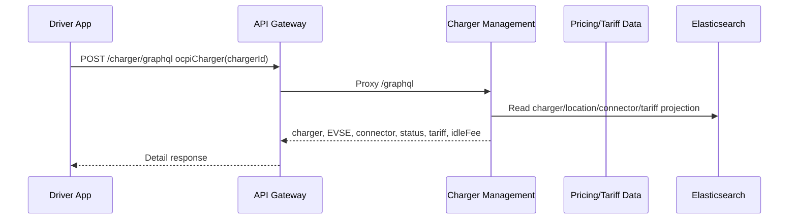

Response fields to show in animation:

- `chargerId`, `chargerName`, `status`
- `availablePorts`, `busyPorts`
- `location.ocpiLocationId`, name, coordinates
- `pricing.tariffs[]`
- `pricing.idleFee.enabled`, `pricePerMinute`, `currency`, `sourceTariffId`
- `evses[].connectors[].status`, `standard`, `powerType`, `tariffIds`

Important consistency rule:

- Price plan idle fee and active session idle fee must use the same source. The active session resolves pricing through session-service, pricing-service, and/or OCPI connector tariff snapshot.

## End-To-End Flow 2: Driver Starts Charging From Mobile App

Primary API:

- Public: `POST https://api.electrahub.net/session/api/v1/sessions/start`
- Backend: `session-service /api/v1/sessions/start`

Typical request fields:

- `stationId`
- `chargerId`
- `connectorId` or connector ref
- `connectorType`
- `paymentMethod`
- idempotency key

High-level sequence:

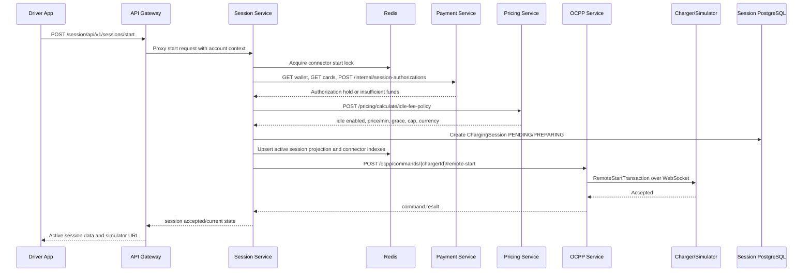

Start-flow responsibilities:

| Step | Owning Service | Notes For Animation |
| --- | --- | --- |
| Authentication/RBAC | API Gateway | Validates JWT/cookies, forwards account context. |
| Connector race guard | Session Service + Redis | Start lock prevents duplicate concurrent starts. |
| Wallet/card check | Session -> Payment | `GET /api/v1/payment/wallet`, `GET /api/v1/payment/cards`. |
| Payment hold | Session -> Payment | `POST /api/v1/payment/internal/session-authorizations`. |
| Idle fee policy | Session -> Pricing | `POST /api/v1/pricing/calculate/idle-fee-policy`. |
| Session creation | Session DB | `ChargingSession` stores user, charger, connector, payment, idle policy, status. |
| Remote start | Session -> OCPP | `POST /api/v1/ocpp/commands/{chargePointId}/remote-start`. |
| Charger command | OCPP -> charger WS | OCPP service sends OCPP JSON-RPC over active WebSocket. |

Animation state labels:

1. `Requested`
2. `Connector locked`
3. `Wallet/card authorized`
4. `Idle policy resolved`
5. `Session pending`
6. `RemoteStart sent`
7. `Waiting for StartTransaction`

## End-To-End Flow 3: Charger Authorize And StartTransaction

The charger/simulator can start after app remote-start, RFID tap, credit card tap, or Plug and Charge.

OCPP ingress:

- WebSocket endpoint: `/ws/ocpp/{chargePointId}`
- OCPP service handler package: `ocpp-service/src/main/java/com/electrahub/ocpp/handler`
- OCPP JSON-RPC actions:
  - `BootNotification`
  - `Authorize`
  - `StartTransaction`
  - `MeterValues`
  - `StopTransaction`
  - `StatusNotification`
  - `TransactionEvent` for OCPP 2.0.1

Sequence:

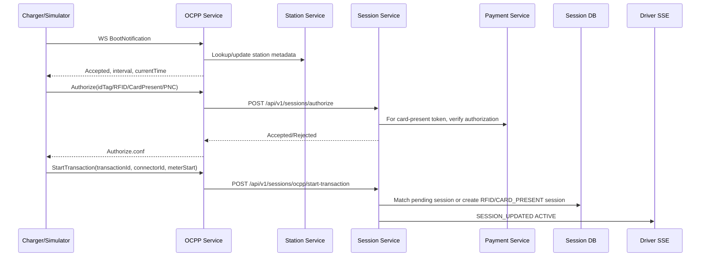

Session callback endpoints used by OCPP service:

| OCPP Action | OCPP Service Callback | Session Effect |
| --- | --- | --- |
| `Authorize` | `POST /api/v1/sessions/authorize` | Validates idTag. Card-present tokens go through payment verification. |
| `StartTransaction` | `POST /api/v1/sessions/ocpp/start-transaction` | Finds pending session by charger/connector or creates RFID/card-present session, sets OCPP transaction id, meter start, `ACTIVE`. |
| `MeterValues` | `POST /api/v1/sessions/ocpp/meter-values/{transactionId}` | Persists meter value, updates energy/current power/cost, checks idle/low balance, publishes active update. |
| `StopTransaction` | `POST /api/v1/sessions/ocpp/stop-transaction/{transactionId}` | Pauses to idle or completes, depending on idle policy and unplug/remote stop context. |
| `StatusNotification` | `POST /api/v1/sessions/ocpp/status-notification` | Updates connector status projection and session status. |

Card-present behavior:

- Simulator HMI button `Tap credit card` should create or pass a card-present auth token.
- Session service detects card-present tokens.
- `CardPresentPaymentClient.verify(...)` calls `POST /api/v1/payment/internal/card-present/authorizations/verify`.
- If valid, the session stores:
  - `authMethod = CREDIT_CARD`
  - `paymentMethod = CARD_PRESENT`
  - `paymentAuthorizationId`
  - `paymentProviderReference`
  - `paymentToken`
- Card-present sessions may not have a registered user account. Do not animate subscription discount for anonymous card-present sessions unless a user allocation exists.

RFID/PnC behavior:

- RFID/ID token starts through `Authorize` then `StartTransaction`.
- Plug and Charge should represent ISO 15118 contract authorization with `EMID`/contract certificate before starting.
- The exact token is carried as idTag/idToken into OCPP authorization.

## End-To-End Flow 4: MeterValues, Realtime Cost, Subscription Preview, Low Balance

Primary callback:

- `POST /session/api/v1/sessions/ocpp/meter-values/{transactionId}`

Sequence:

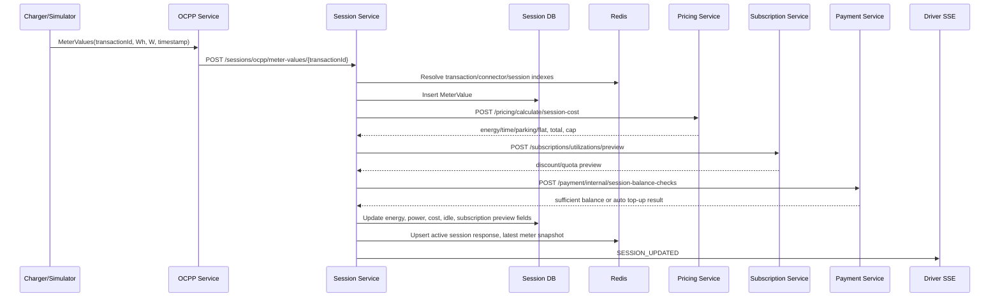

Cost calculation details:

| Calculation | Owner | Input | Output |
| --- | --- | --- | --- |
| Energy/time/parking/flat cost | Pricing Service | `locationId`, `connectorType`, `energyWh`, `durationSeconds`, `parkingSeconds`, start/end | Cost breakdown, total, currency, applied plan id/name, max total cap. |
| Taxes | Session Service currently applies tax in receipt/cost composition | Total/gross amount | `taxesUsd`, currently calculated as 10% in code paths. |
| Subscription preview | Subscription Service | user id/allocation context, charging cost, session fee, idle fee, taxes, energy, quota units | Discount amounts, final charge, quota consumed, plan metadata. |
| Low balance check | Payment Service | account id, session id, projected charge, threshold, currency | `sufficientBalance`, `autoTopUpApplied`, wallet before/after. |

Animation notes:

- MeterValue persistence is durable and high frequency. Draw it as repeated pulses into `MeterValue` table.
- Active-session updates are optimized through Redis so the mobile app does not need to hit PostgreSQL on every tick.
- Pricing and subscription previews are synchronous service calls from session-service. Use narrow request/response arrows.
- If low balance threshold is breached and auto top-up cannot recover balance, session-service should trigger remote stop with a low-balance reason and publish a driver-visible message.

## End-To-End Flow 5: Idle Fee Detection

Idle can begin in two ways:

1. During charging, `MeterValues.powerW <= 250 W` while idle fee is enabled.
2. Driver taps remote stop, the charger sends `StopTransaction`, but the cable is still plugged in and idle fee applies.

Idle policy sources:

| Source | Used When |
| --- | --- |
| Pricing Service `POST /api/v1/pricing/calculate/idle-fee-policy` | Primary structured idle-fee policy by location and connector type. |
| Elasticsearch `ocpi-connectors` tariff snapshot | Fallback/connector-specific tariff snapshot via `OcpiConnectorTariffClient`. |
| Charger detail GraphQL OCPI tariff | Driver-facing price plan display. |

Idle session fields:

- `idleFeeEnabled`
- `idleFeePerMinute`
- `idleFeeGracePeriodSeconds`
- `idleFeeMaxAmount`
- `idleStartedAt`
- `idleSecondsAccumulated`
- `costTotal`
- `costGross`
- `sessionMaxAmount`
- `remoteStopRequestedAt`
- `simulatorSecurityCode`

Animation states:

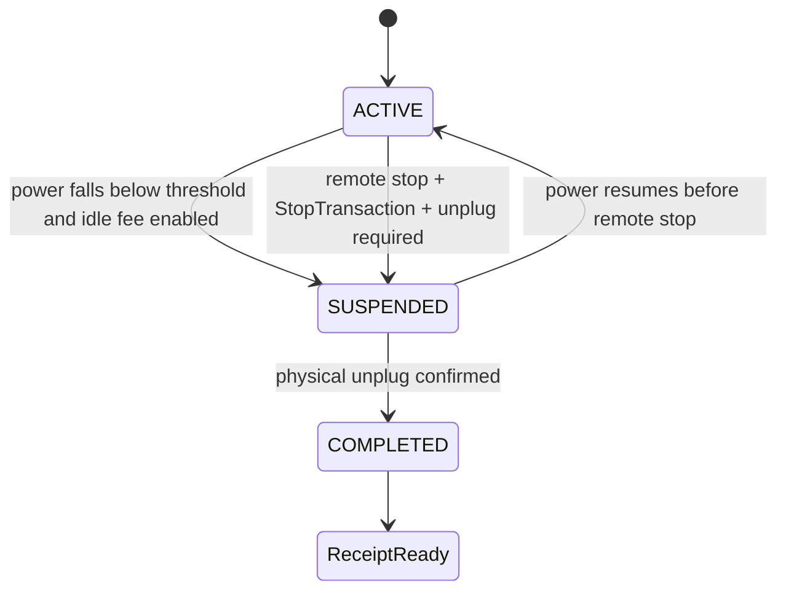

Important remote-stop idle rule:

- Remote stop with idle fee does not mean session completed.
- `StopTransaction` moves session to `SUSPENDED`.
- Session-service registers idle ticker and publishes `CHARGING_IDLE_STARTED`.
- The simulator/charger may emit immediate `StatusNotification Available`; session-service ignores immediate Available during the remote-stop guard window because it can be an automatic state emission, not a physical unplug.
- Physical unplug must be represented by a deliberate simulator HMI unplug action or real charger unplug signal.

## End-To-End Flow 6: Driver Active Session Pull And SSE Stream

APIs:

- `GET /session/api/v1/sessions/active`
- `GET /session/api/v1/sessions/{id}/current`
- `GET /session/api/v1/sessions/active/stream`

Sequence:

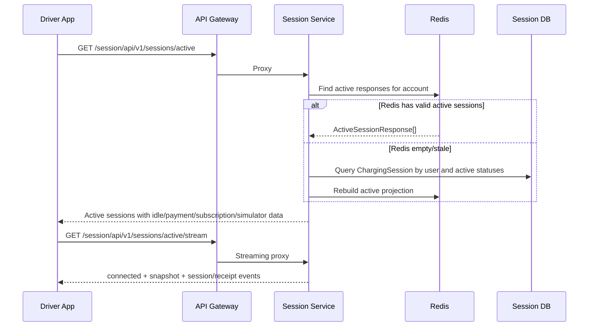

Active session response should include:

- `id`, `stationId`, `stationName`
- `chargerId`, `connectorId`, `connectorType`
- `startedAt`
- `energyDeliveredKwh`
- `currentPowerKw`
- `estimatedCost`
- `status`
- `idleFeeEnabled`
- `idleSeconds`
- `idleFeePerMinute`
- `idleFeeAmount`
- `idleStartedAt`
- `unplugRequiredToStop`
- `regularCost`
- `discountedCost`
- `subscriptionDiscountApplied`
- subscription plan/quota fields
- simulator object:
  - `url`
  - `securityCode` may be passed in URL for simulator but should not be visibly displayed on mobile active screen
  - `chargerId`
  - `connectorId`
  - `sessionId`

Animation note:

- For mobile UX, show active screen first loading from REST, then live changes arriving through SSE.

## End-To-End Flow 7: Driver Remote Stop With Idle Fee

API:

- `POST /session/api/v1/sessions/{sessionId}/stop`
- Body example: `{"reason":"Remote","userInitiated":true}`

Correct animation for idle-fee configured connector:

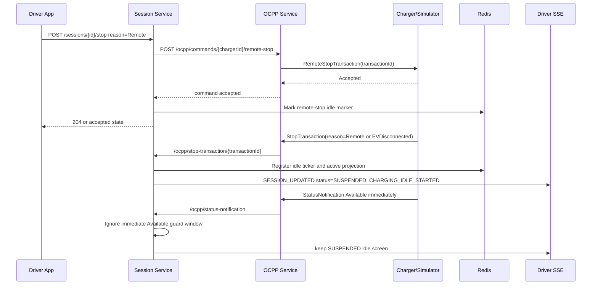

Correct animation for connector without idle fee:

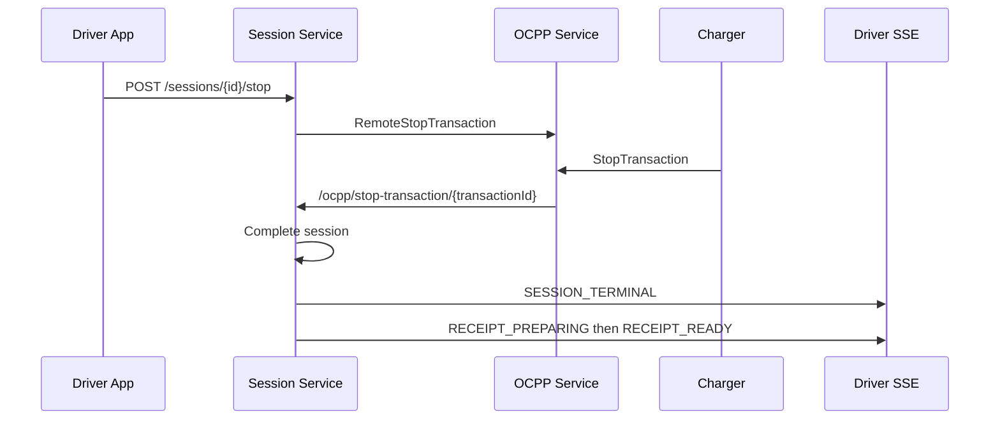

Do not animate receipt immediately after remote stop for idle-fee sessions. Receipt appears only after unplug completes the session.

## End-To-End Flow 8: Simulator Unplug With Security Code

User opens simulator URL from active session:

- URL shape: `https://ocpp-simulator.electrahub.net/#charger/{chargerId}/connector/{connectorId}?sessionId={sessionId}&securityCode={code}`
- Mobile app should pass security code in URL and not visibly display it on the active charging screen.

Simulator behavior:

| Charger State | Idle Fee Enabled | Security Code UI | Unplug Behavior |
| --- | --- | --- | --- |
| No active session | No/irrelevant | Do not ask | Unplug/Available can happen immediately. |
| Active charging | Idle fee false | Usually no code needed | Stop/unplug completes. |
| Suspended idle after remote stop | Idle fee true | Auto-filled if `securityCode` query param exists; otherwise prompt | Verify code against session-service, then emit unplug/Available/StopTransaction completion path. |

APIs and events:

- Simulator HMI calls session-service verification:
  - `POST /session/api/v1/sessions/{id}/simulator/verify-code`
- Simulator emits OCPP status/meter/stop actions to backend via its configured connector path.
- Session-service validates that code belongs to the session and connector.

Animation sequence:

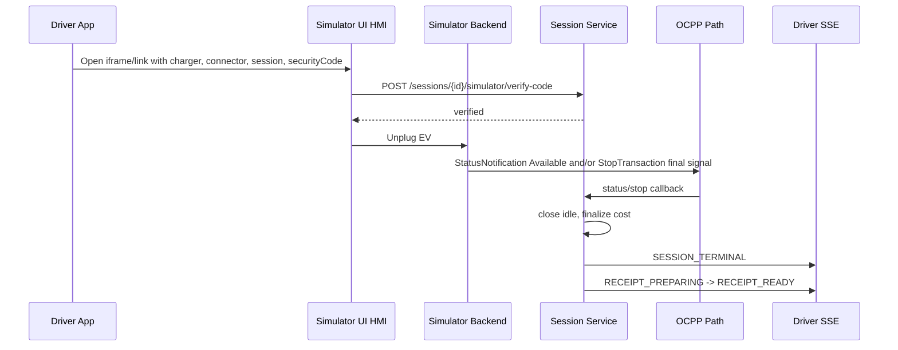

## End-To-End Flow 9: Receipt Generation, Payment Settlement, Subscription Record, Kafka

Receipt generation begins after session reaches terminal state.

Sequence:

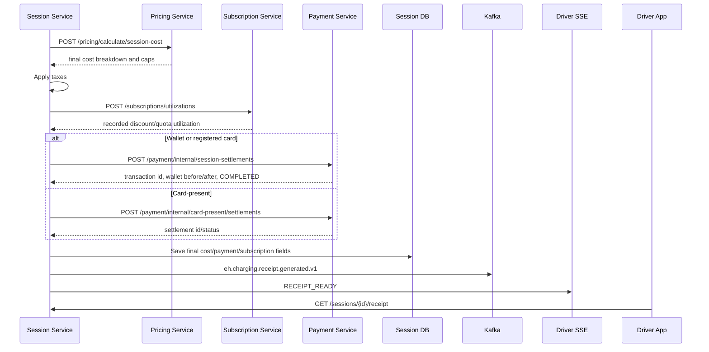

Receipt API:

- Driver: `GET /session/api/v1/sessions/{id}/receipt`
- Admin: `GET /session/api/v1/sessions/admin/{id}/receipt`

Receipt fields to show:

- `sessionId`
- `station`
- `connector`
- `startedAt`
- `endedAt`
- `energyKwh`
- display tariff/rate carefully:
  - Do not present blended total/energy as tariff if idle/taxes are included.
  - Show base energy rate, idle fee, taxes, discounts, and total separately.
- `taxesUsd`
- `idleSeconds`
- `idleFee`
- `regularCost`
- `subscriptionDiscountAmount`
- subscription plan/quota fields
- `totalCost`
- `paymentMethod`
- payment display:
  - Registered card/wallet: show masked card or wallet.
  - Card-present: show "Credit Card" and masked/payment token if available, not raw provider transaction id.
  - If ElectraHub authorized the card, show ElectraHub transaction id rather than provider transaction id.

## End-To-End Flow 10: Admin Charging Session Search And Actions

Admin APIs:

- `GET /session/api/v1/sessions/admin/search`
- `POST /session/api/v1/sessions/admin/{id}/stop`
- `GET /session/api/v1/sessions/admin/{id}/receipt`

Search filters:

- status group: active/completed
- location
- charger
- connector
- station id
- driver id/account
- driver type
- payment mode
- auth method
- search text/session id/transaction id

Admin list animation:

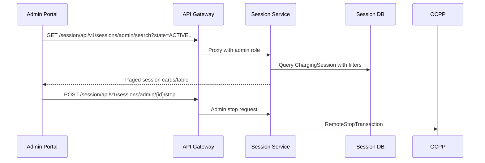

Admin UX details:

- Active sessions should expose a stop action.
- Completed sessions should expose receipt view.
- Mobile list must show cards if table columns cannot fit.
- Payment method should be human readable:
  - `CARD_PRESENT` -> "Credit Card" or "Credit Card - card present"
  - Include masked card number when available.

## End-To-End Flow 11: OCPI Partner Data Exchange

OCPI service exposes CPO/eMSP endpoints:

| Endpoint | Purpose |
| --- | --- |
| `GET /ocpi/versions` | OCPI version discovery. |
| `GET /ocpi/2.2.1` | OCPI endpoint discovery. |
| `GET /ocpi/2.2.1/cpo/locations` | Partner pulls locations/EVSE/connectors. |
| `GET /ocpi/2.2.1/cpo/locations/{locationId}` | Partner pulls one location. |
| `GET /ocpi/2.2.1/cpo/tariffs` | Partner pulls tariffs. |
| `GET /ocpi/2.2.1/cpo/sessions` | Partner pulls sessions. |
| `GET /ocpi/2.2.1/cpo/cdrs` | Partner pulls CDRs. |
| `GET/PUT/POST /ocpi/2.2.1/emsp/tokens/**` | Token lookup/authorization. |
| `POST /ocpi/2.2.1/emsp/commands/START_SESSION` | Partner remote start. |
| `POST /ocpi/2.2.1/emsp/commands/STOP_SESSION` | Partner remote stop. |
| `POST /ocpi/2.2.1/emsp/commands/UNLOCK_CONNECTOR` | Partner unlock connector. |

Sync jobs:

- Location sync scheduled by `ocpi.sync.locations-cron`.
- Admin triggers:
  - `POST /api/v1/ocpi/admin/sync/locations`
  - `POST /api/v1/ocpi/admin/sync/sessions`
  - `POST /api/v1/ocpi/admin/sync/cdrs`
- Sync queue admin:
  - `GET /api/v1/ocpi/sync/queue`
  - `POST /api/v1/ocpi/sync/queue/{itemId}/retry`
  - `DELETE /api/v1/ocpi/sync/queue/completed`

Animation:

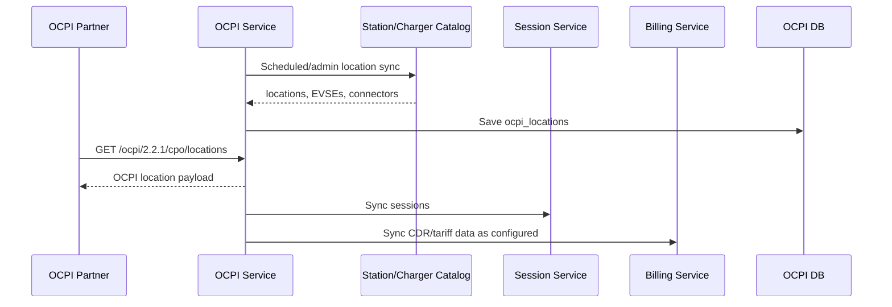

## End-To-End Flow 12: Pricing And Tariff Administration

Pricing APIs:

| Endpoint | Purpose |
| --- | --- |
| `POST /api/v1/pricing/plans` | Create pricing plan. |
| `GET /api/v1/pricing/plans` | List/search plans. |
| `PUT /api/v1/pricing/plans/{planId}` | Update plan. |
| `POST /api/v1/pricing/calculate/session-cost` | Final/running session cost. |
| `POST /api/v1/pricing/calculate/idle-fee-policy` | Idle fee policy lookup. |
| `POST /api/v1/pricing/calculate/estimate` | Driver estimate. |
| `POST /api/v1/pricing/calculate/realtime` | Realtime active charging estimate. |
| `/api/v1/pricing/search/**` | Search/reindex pricing documents. |
| `/api/v1/pricing/history/**` | Price history. |
| `/api/v1/pricing/signals/**` | Price signals. |
| `/api/v1/pricing/ocpi/**` | OCPI tariff conversion/sync. |

Pricing dimensions:

- `ENERGY`
- `TIME`
- `PARKING` (used for idle fee)
- `FLAT`

Pricing caps:

- Component-level min/max price.
- Plan-level max total cost.
- Idle fee max amount via parking component max price/policy.

Animation note:

- Show pricing plan as an input to both driver price display and session cost calculation.
- Show parking component becoming idle fee policy.

## End-To-End Flow 13: Payment Wallet, Auto Top-Up, Holds, Settlement

Payment APIs:

| Endpoint | Purpose |
| --- | --- |
| `GET /api/v1/payment/state` | Driver payment state aggregate. |
| `GET /api/v1/payment/wallet` | Wallet balance/config. |
| `GET /api/v1/payment/wallet/topups` | Top-up history. |
| `POST /api/v1/payment/wallet/topups` | Add top-up. |
| `POST /api/v1/payment/reload` | Reload payment state. |
| `GET /api/v1/payment/cards` | List cards. |
| `POST /api/v1/payment/cards` | Add card. |
| `DELETE /api/v1/payment/cards/{cardId}` | Delete card. |
| `GET /api/v1/payment/auto-topup` | Get auto top-up config. |
| `PUT /api/v1/payment/auto-topup` | Update auto top-up config. |
| `POST /api/v1/payment/internal/accounts` | Provision wallet/account. |
| `POST /api/v1/payment/internal/session-authorizations` | Create session hold. |
| `POST /api/v1/payment/internal/session-authorizations/{sessionId}/release` | Release hold. |
| `POST /api/v1/payment/internal/session-balance-checks` | Check balance and auto top-up if configured. |
| `POST /api/v1/payment/internal/session-settlements` | Settle wallet/card-backed session. |
| `POST /api/v1/payment/internal/card-present/authorizations` | Create card-present authorization. |
| `POST /api/v1/payment/internal/card-present/authorizations/verify` | Verify card-present token. |
| `POST /api/v1/payment/internal/card-present/settlements` | Settle anonymous/card-present session. |

Payment data stores:

- `payment.payment_wallet`
- `payment.payment_card`
- `payment.payment_auto_topup_config`
- `payment.payment_topup`
- `payment.payment_session_authorization`
- `payment.payment_session_transaction`

Auto top-up animation:

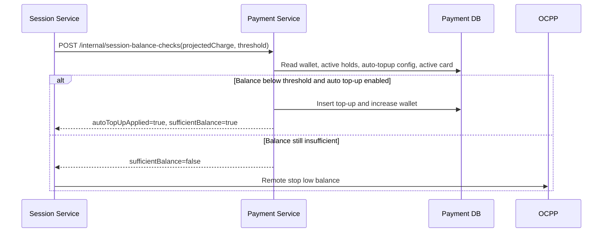

## End-To-End Flow 14: Subscription Discount Preview And Record

Subscription APIs:

| Endpoint | Purpose |
| --- | --- |
| `GET /api/v1/driver/subscriptions/me` | Driver subscription allocation/status. |
| `GET /api/v1/driver/subscriptions/plans` | Driver-visible plans. |
| `POST /api/v1/subscriptions/plans` | Admin create plan. |
| `GET /api/v1/subscriptions/plans` | List plans. |
| `PUT /api/v1/subscriptions/plans/{planId}` | Update plan. |
| `POST /api/v1/subscriptions/allocations` | Create allocation. |
| `GET /api/v1/subscriptions/allocations` | List allocations. |
| `PATCH /api/v1/subscriptions/allocations/{allocationId}/status` | Change allocation status. |
| `POST /api/v1/subscriptions/utilizations/preview` | Preview discount without committing quota. |
| `POST /api/v1/subscriptions/utilizations` | Record utilization and quota consumption. |
| `GET /api/v1/subscriptions/utilizations` | List utilization. |
| `GET /api/v1/subscriptions/audit-logs` | Audit logs. |
| `POST /api/v1/admin/subscriptions/grants` | Admin grant allocation/quota. |

Discount fields:

- plan code/name
- allocation id
- quota unit
- quota consumed
- covered/uncovered energy
- total fee discount
- session fee discount
- total discount
- final charge including/excluding tax
- quota exhausted

Animation:

- Use `preview` during active session updates.
- Use `record` once, during receipt/finalization.
- Show quota counter decrement only on record, not on preview.

## End-To-End Flow 15: Notifications And Project Brief

Use when animating project brief/contact flow and admin notification inbox.

Likely public flow:

1. User submits project brief on `electrahub.com`.
2. API gateway routes notification/project-brief API to `notification-service`.
3. Notification service stores a notification.
4. Admin portal notification tab fetches inbox.
5. Opening a notification marks it as read.

Animation requirements:

- Rate limit: 1 request/second for the project brief API at gateway/common API layer.
- Admin inbox resembles mail:
  - unread/read states
  - open message marks read
  - filter/search by status/type if available

## Animation Scene Library

Use these scenes as reusable clips:

| Scene | Start | End |
| --- | --- | --- |
| Gateway ingress | Mobile/Admin sends HTTPS request | Gateway chooses service route. |
| JWT/RBAC | Gateway reads JWT/cookies | Request accepted/denied by role. |
| Remote start | Session receives start | OCPP command accepted by charger. |
| Charger callback | Charger emits OCPP action | Session callback updates lifecycle. |
| Meter pulse | MeterValues arrives | DB insert + Redis active update + SSE update. |
| Idle transition | Power low or remote stop | Session becomes `SUSPENDED`, idle ticker starts. |
| Protected remote stop | Immediate Available after remote stop | Session stays idle, no receipt. |
| Physical unplug | User clicks unplug HMI | Session completes and receipt starts. |
| Pricing calculation | Session sends cost request | Pricing returns cost breakdown/caps. |
| Subscription preview | Session sends preview | UI shows discounted projected cost. |
| Subscription record | Receipt finalization sends record | Quota permanently consumed. |
| Wallet auth | Start request checks wallet/card | Hold created or start denied. |
| Auto top-up | Balance falls below threshold | Wallet top-up or low-balance stop. |
| Payment settlement | Receipt finalization | Payment transaction completed. |
| Kafka analytics | Receipt ready | Analytics event emitted asynchronously. |
| Admin session search | Admin opens sessions | Filtered active/completed list. |
| OCPI sync | Scheduled sync | Partner reads locations/sessions/CDRs. |

## Full Start-To-Receipt Swimlane

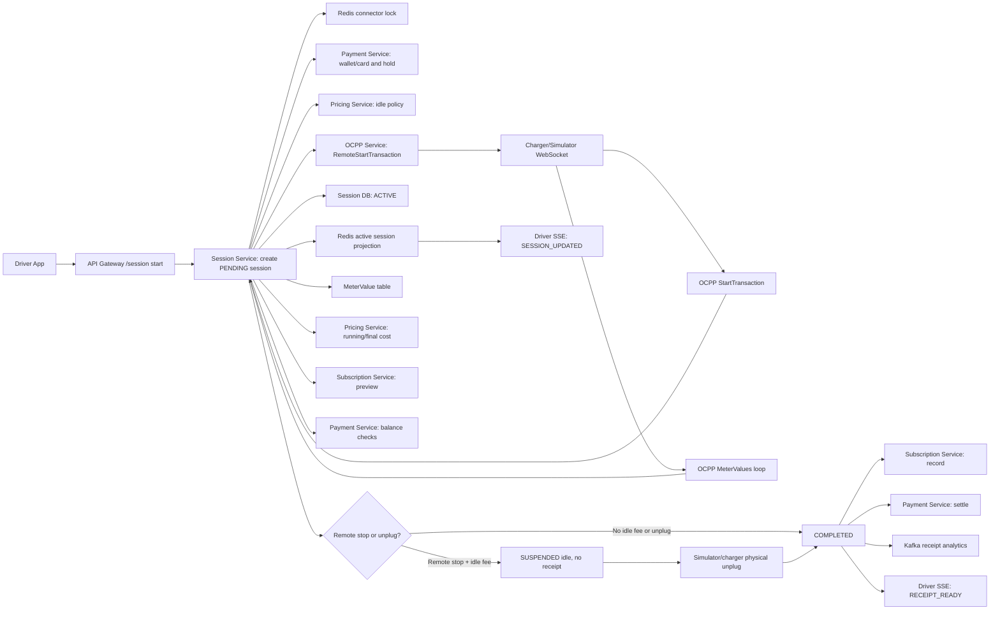

## API Reference Cheat Sheet

### Driver Session

| Method | Path | Owner | Animation Use |
| --- | --- | --- | --- |
| `POST` | `/session/api/v1/sessions/start` | Session | Driver starts charging. |
| `POST` | `/session/api/v1/sessions/{id}/stop` | Session | Driver remote stop. |
| `GET` | `/session/api/v1/sessions/active` | Session | Active session polling. |
| `GET` | `/session/api/v1/sessions/{id}/current` | Session | Current session detail. |
| `GET` | `/session/api/v1/sessions/active/stream` | Session | Live SSE updates. |
| `GET` | `/session/api/v1/sessions/history` | Session | Driver charging history. |
| `GET` | `/session/api/v1/sessions/{id}/receipt` | Session | Driver receipt. |
| `POST` | `/session/api/v1/sessions/{id}/simulator/verify-code` | Session | Simulator unplug authorization. |

### OCPP Callbacks

| Method | Path | Owner | Animation Use |
| --- | --- | --- | --- |
| `POST` | `/session/api/v1/sessions/authorize` | Session | OCPP authorize callback. |
| `POST` | `/session/api/v1/sessions/ocpp/start-transaction` | Session | Charger starts transaction. |
| `POST` | `/session/api/v1/sessions/ocpp/meter-values/{transactionId}` | Session | Charger meter values. |
| `POST` | `/session/api/v1/sessions/ocpp/stop-transaction/{transactionId}` | Session | Charger stops transaction. |
| `POST` | `/session/api/v1/sessions/ocpp/status-notification` | Session | Connector state update. |

### OCPP Remote Commands

| Method | Path | Owner | Animation Use |
| --- | --- | --- | --- |
| `POST` | `/api/v1/ocpp/commands/{chargePointId}/remote-start` | OCPP | Send RemoteStartTransaction. |
| `POST` | `/api/v1/ocpp/commands/{chargePointId}/remote-stop` | OCPP | Send RemoteStopTransaction. |
| `POST` | `/api/v1/ocpp/commands/{chargePointId}/reset` | OCPP | Reset charger. |
| `POST` | `/api/v1/ocpp/commands/{chargePointId}/unlock-connector` | OCPP | Unlock connector. |
| `POST` | `/api/v1/ocpp/commands/{chargePointId}/change-availability` | OCPP | Change connector availability. |
| `POST` | `/api/v1/ocpp/commands/{chargePointId}/change-configuration` | OCPP | Change OCPP configuration key. |
| `POST` | `/api/v1/ocpp/commands/{chargePointId}/get-configuration` | OCPP | Read OCPP config. |
| `POST` | `/api/v1/ocpp/commands/{chargePointId}/trigger-message` | OCPP | Ask charger to emit OCPP message. |

Note: session-service calls OCPP service internally with `/api/v1/ocpp/commands/...`. If an admin UI needs direct OCPP command access through API gateway, add and document an explicit gateway route first.

### Admin Session

| Method | Path | Owner | Animation Use |
| --- | --- | --- | --- |
| `GET` | `/session/api/v1/sessions/admin/search` | Session | Admin active/completed session list. |
| `POST` | `/session/api/v1/sessions/admin/{id}/stop` | Session | Admin stop active session. |
| `GET` | `/session/api/v1/sessions/admin/{id}/receipt` | Session | Admin receipt view. |

### Pricing

| Method | Path | Owner |
| --- | --- | --- |
| `POST` | `/pricing/api/v1/pricing/calculate/session-cost` | Pricing |
| `POST` | `/pricing/api/v1/pricing/calculate/idle-fee-policy` | Pricing |
| `POST` | `/pricing/api/v1/pricing/calculate/estimate` | Pricing |
| `POST` | `/pricing/api/v1/pricing/calculate/realtime` | Pricing |

### Payment

| Method | Path | Owner |
| --- | --- | --- |
| `GET` | `/payment/api/v1/payment/wallet` | Payment |
| `GET` | `/payment/api/v1/payment/cards` | Payment |
| `PUT` | `/payment/api/v1/payment/auto-topup` | Payment |
| `POST` | `/payment/api/v1/payment/internal/session-authorizations` | Payment |
| `POST` | `/payment/api/v1/payment/internal/session-balance-checks` | Payment |
| `POST` | `/payment/api/v1/payment/internal/session-settlements` | Payment |
| `POST` | `/payment/api/v1/payment/internal/card-present/authorizations/verify` | Payment |
| `POST` | `/payment/api/v1/payment/internal/card-present/settlements` | Payment |

### Subscription

| Method | Path | Owner |
| --- | --- | --- |
| `GET` | `/subscription/api/v1/driver/subscriptions/me` | Subscription |
| `GET` | `/subscription/api/v1/driver/subscriptions/plans` | Subscription |
| `POST` | `/subscription/api/v1/subscriptions/utilizations/preview` | Subscription |
| `POST` | `/subscription/api/v1/subscriptions/utilizations` | Subscription |
| `GET` | `/subscription/api/v1/subscriptions/allocations` | Subscription |
| `POST` | `/subscription/api/v1/admin/subscriptions/grants` | Subscription |

## Critical Correctness Rules For Animations

1. Do not show session receipt generation before physical unplug when idle fee is enabled and remote stop was requested.
2. Do not show raw provider transaction ids to admins or drivers; show ElectraHub transaction id if ElectraHub authorized payment.
3. Do not show transaction id inside explicit simulator `Available` events after unplug if OCPP protocol forbids it.
4. Show `MeterValues` as high-frequency, idempotent updates. It updates cost and SSE but should not create duplicate sessions.
5. Show Redis as a fast projection and coordination layer, not the source of truth. PostgreSQL `ChargingSession` is canonical.
6. Show subscription preview during active charging and subscription record during receipt finalization.
7. Show taxes after pricing cost and before final payable/receipt display.
8. Show payment authorization at start and payment settlement at final receipt.
9. Show auto top-up inside balance check, not as a separate mobile-triggered action during charging.
10. Show admin portal reads through API gateway and session-service; admin does not read DB directly.

## Known Implementation Gaps To Mark As Caution In Animations

Use small "implementation detail" callouts for these:

- Tax is currently applied inside session-service as a percentage calculation path; a dedicated tax service is not shown in the current traced flow.
- Receipt analytics Kafka is optional and controlled by `SESSION_ANALYTICS_KAFKA_ENABLED`.
- OCPP service keeps live WebSocket sessions in memory; production scaling needs sticky sessions or distributed command routing.
- OCPI/simulator names are historically inconsistent: the active simulator repo is `ocpi-simulator`, and its UI lives under `ocpi-simulator/ui`.
- Some API paths differ when called through gateway versus service-to-service. Public paths include the service prefix, internal RestClient paths usually do not.

## Suggested Animation Deliverables

Create one animation per flow:

1. "Driver Opens Charger Detail and Price Plan"
2. "Remote Start to OCPP StartTransaction"
3. "RFID/Credit Card/Plug and Charge Authorization"
4. "MeterValues to Realtime Cost"
5. "Subscription Preview and Quota"
6. "Low Balance and Auto Top-Up"
7. "Remote Stop With Idle Fee"
8. "Simulator Security Code and Unplug"
9. "Receipt, Payment Settlement, and Kafka Analytics"
10. "Admin Session Search, Receipt, and Stop"
11. "OCPI Location/Tariff/Session/CDR Sync"
12. "Pricing Plan and Idle Fee Configuration"

Each animation should include:

- Service swimlane
- API call labels
- State labels
- Data store write/read bubbles
- Success path
- Failure branch
- User-visible UI outcome
