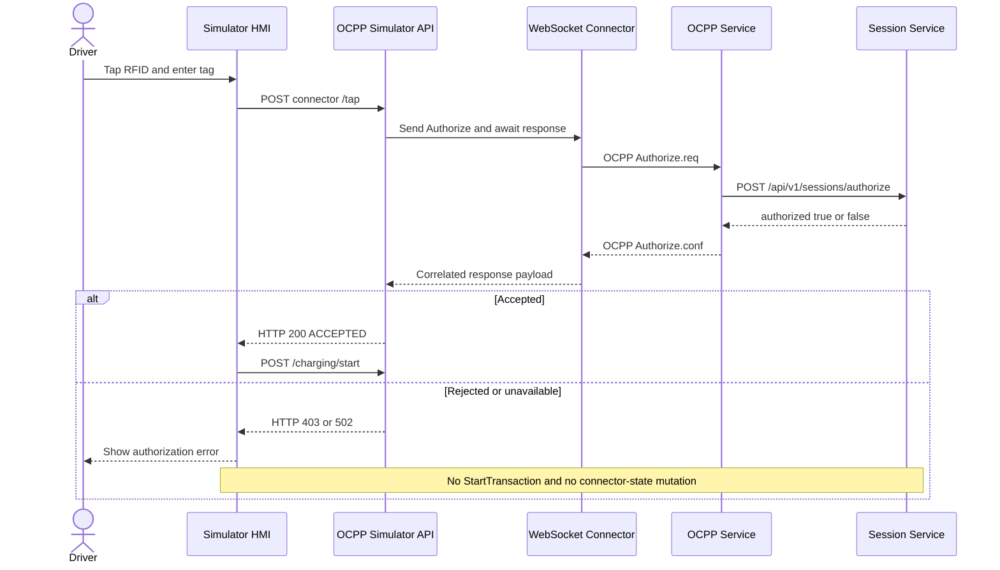

# Simulator RFID Authorization

## Product Rule

An RFID value entered on the simulator HMI is an authorization credential, not a request to start charging. The charging flow must proceed only when the ElectraHub authorization system explicitly accepts that credential.

Unknown, blocked, expired, malformed, or unverifiable RFID credentials must fail closed. A failed authorization must not create a simulator transaction, emit a charging status, or call the charging-start API.

## End-to-End Sequence

## Root Cause

The simulator previously treated successful delivery of `Authorize.req` as successful authorization. The asynchronous bridge returned `SENT`, and the simulator emitted `AUTH_ACCEPTED` without consuming `Authorize.conf` from the CSMS.

During the corrected production test, a second issue surfaced: `ocpp-service` used Jackson 2 `JsonNode` as the Spring Boot 4 `RestClient` response type. The configured HTTP converter could not deserialize that type and returned a secure but incorrect fallback rejection for every RFID.

## Implemented Contract

### WebSocket Connector

- Registers a pending response channel before sending an OCPP call.
- Correlates OCPP CALLRESULT and CALLERROR frames by message ID.
- Supports an optional synchronous `/send` mode with a bounded timeout.
- Removes pending entries after success, error, disconnect, or timeout.
- Retains the original asynchronous behavior for existing callers.

### Simulator Backend

- Requires a non-blank RFID.
- Waits up to five seconds for `Authorize.conf`.
- Accepts only OCPP status `Accepted` for OCPP 1.6 and 2.0.1 response shapes.
- Returns HTTP 403 for authorization rejection.
- Returns HTTP 502 for bridge, CSMS, or timeout failures.
- Emits `AUTH_REJECTED` or `AUTH_FAILED` without creating a transaction.

### Simulator HMI

- Calls `/charging/start` only after `/tap` returns success.
- Keeps the RFID dialog open on rejection.
- Shows the backend rejection message inside the dialog.

### OCPP Service

- Deserializes the session authorization response into a typed record.
- Maps `authorized=true` to OCPP `Accepted` and all other outcomes to `Invalid`.

## Verification

### Automated

- WebSocket connector Go tests: pass.
- Simulator Go tests: pass.
- Simulator Angular tests: 14/14 pass.
- Simulator Angular production build: pass.
- OCPP service Maven tests: 6/6 pass.

### Production

Target: `EH-US-CHG-0003`, connector `1` / `CON-US-0003`.

| Scenario | Expected | Observed |
| --- | --- | --- |
| Registered temporary RFID | HTTP 200 and `ACCEPTED` | Pass |
| Unknown RFID | HTTP 403 and `INVALID` | Pass |
| Rejected-card connector status | Remains `Available` | Pass |
| Rejected-card active transactions | Remains zero | Pass |
| Temporary test data cleanup | No test token remains | Pass |

## Operational Note

After an `ocpp-service` restart, existing simulated WebSocket connections must be re-established. The production rollout recycled the bridge pod after the CSMS update before the final acceptance tests. Automatic reconnect behavior should remain a separate resilience backlog item because it is independent of the authorization decision contract.
