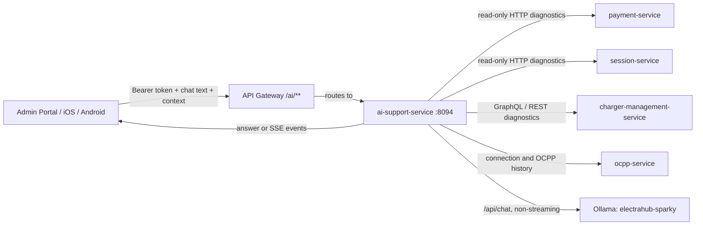

# Sparky AI Support and Ollama Architecture

## Request summary

Document how Sparky currently integrates with the AI support service and Ollama, which model is configured, what live data it can read, whether it has database or infrastructure access, and how a response reaches the client.

## Scope and evidence

| Area | Evidence reviewed |
| --- | --- |
| AI service | `ai-support-service` source: controllers, diagnostic client, routing LLM client, Ollama client, in-memory chat store, prompt and knowledge-base classes. |
| Client callers | Admin Portal Sparky component; iOS `AiChatService`/`SparkyViewModel`; Android AI chat repository/view model. |
| Gateway/deployment | API gateway `/ai/**` route/policy and production Helm/Argo configuration. |
| Model runtime | `http://localhost:11434/api/tags` on 2026-07-21. |

## Historical baseline before the 8B upgrade

| Item | Current value |
| --- | --- |
| Production provider configuration | `ollama` |
| Requested model name | `electrahub-sparky` |
| Runtime model verified locally | `electrahub-sparky:latest` |
| Base model | `qwen2.5:0.5b` |
| Family / quantization | Qwen2, Q4_K_M |
| Parameter size | 494.03M |
| Local model size | 397,823,399 bytes (about 398 MB) |
| Model context capability | 32,768 tokens reported by Ollama; the service prompt/model configuration constrains practical input much more tightly. |
| Temperature | `0.2` |
| Production response limit | `140` tokens requested; service clamps the maximum to `180`. |
| LLM timeout | `10` seconds in production values. |

`electrahub-sparky` is not a separately trained/fine-tuned foundation model. It is an Ollama model definition built from `qwen2.5:0.5b` with an ElectraHub system prompt. The service also injects a small keyword-selected static knowledge base and, where available, summarized live backend facts.

This was the pre-upgrade baseline. The following implementation status supersedes these model values.

## Current model after the 8B upgrade

| Item | Current value |
| --- | --- |
| Runtime model name | `electrahub-sparky:8b` |
| Base model | `qwen3:8b` |
| Model size / quantization | 8.2B parameters, Q4_K_M, approximately 5.2 GB |
| Model context configured for Sparky | 4,096 tokens |
| Temperature | `0.12` |
| Output cap | 320 tokens |
| Ollama reasoning mode | Disabled per request with `think=false`; hidden reasoning is never sent to clients. |
| LLM deadline | 30 seconds, with deterministic fallback on timeout/failure. |
| Chat stream cache | Process-local, 15-minute TTL; one completed answer is reused by the SSE stream. |
| Live diagnostic deadline | Individual calls: 1.8 seconds; concurrent aggregate deadline: 3 seconds. |

The local bootstrap script and Modelfile now both use `qwen3:8b`. The local model was built successfully with `ollama create electrahub-sparky:8b -f ollama/Modelfile`.

### Prompt-quality evaluation

`ai-support-service/scripts/ollama/sparky-prompt-evaluation.json` is the versioned regression catalog. It covers every current runtime prompt category plus the critical operational flows for RFID authorization, Plug and Charge certificate validation, card-present payment privacy, idle/unplug lifecycle, and payment authorization reversal.

The runner `scripts/ollama/evaluate-sparky-prompts.ps1 -FailOnQualityIssue` checks the real local model. Its service mode additionally checks the final answer returned by `ai-support-service`, after deterministic grounding and the response-quality guard, for required operational meaning, prohibited prompt leakage, and a minimum useful answer length.

On July 21, 2026, all 41 cases passed against `electrahub-sparky:8b`. Measured full-response latency on the CPU-only local host was 5.466-13.874 seconds per case, averaging 9.283 seconds. This is a quality improvement, not a two-second latency result; a future GPU benchmark or smaller retrieved model is still required for a stricter interactive SLA.

### Implemented answer path

1. The client sends a bounded screen/resource context and authenticated request.
2. The AI service concurrently obtains read-only payment, session, charger, OCPP connection, and OCPP history diagnostics. Partial data is retained if a dependency misses the total deadline.
3. A deterministic classifier produces the source-of-truth answer for the requested flow.
4. The Qwen 8B model receives only redacted text, selected context, curated project facts, deterministic answer, and summarized backend facts.
5. `SparkyAnswerQualityGuard` rejects blank, generic, prompt-leaking, reasoning-leaking, excessively long, ungrounded, or driver-internal responses. Rejection returns the deterministic answer.
6. The completed answer is stored with the message for 15 minutes. The SSE endpoint streams that same result instead of recalculating diagnostics or calling the model a second time.

### Client-context improvements implemented

| Client | Change |
| --- | --- |
| iOS | The Live Charging tab now publishes the active session, simulator charger, connector, and station/location context to Sparky. |
| Android | Active-session context now includes resource id/type and location. SSE event payloads are parsed and appended to one assistant message instead of rendering raw JSON as several messages. |
| Admin Portal | Page-specific suggested prompts now align with dashboard, sessions, chargers, connectors, pricing, subscriptions, RBAC, and notifications. A fallback page/resource context is sent on every request. |

### What remains intentionally deferred

- Redis-backed shared chat state and durable, privacy-governed conversation/audit storage.
- Signed downstream administrative scope for charger/OCPP diagnostics.
- Retrieval embeddings and an approved document corpus with citations.
- GPU benchmark/acceleration or a smaller model option for sub-two-second experience.

## Deployment topology

### Gateway path

- Public client base: `https://api.electrahub.net/ai` for production web callers.
- Gateway policy matches `/ai/**` and requires a valid authenticated role mapping (`USER` in the current gateway policy).
- The service itself exposes `/api/v1/chat/messages` and `/api/v1/chat/threads/{threadId}/stream`.
- The Kubernetes service is internal (`ClusterIP`) on port `8094`; it does not have its own public ingress.

### Ollama network target

- Base values describe an in-cluster target: `http://ollama:11434`.
- Current production values override this with `http://host.docker.internal:11434`.
- An `ollama-prod` Argo CD application exists, but the current AI-service production override means the service is configured to use the host-reachable Ollama endpoint rather than the Kubernetes `ollama` service name.

The local runtime check confirmed the named model is present on `localhost:11434`. This verifies the host Ollama runtime; it is not a substitute for inspecting the effective environment inside the running production pod.

## What the service can access

### Direct database access: no

The AI support service has no JPA, JDBC, Redis, Elasticsearch, Kafka, RabbitMQ, or repository dependency in its application code or Maven dependencies. It has no AI-specific database.

Chat pending messages are stored only in a process-local `ConcurrentHashMap`:

- no persistence;
- a configurable 15-minute TTL;
- no shared state between replicas;
- lost on pod restart;
- an SSE request routed to another replica would not find the pending message.

### Infrastructure access: no direct access

The service has no Kubernetes client, Docker client, shell/process execution, node/pod access, cloud credentials, or direct Splunk/Grafana/Dynatrace/Elasticsearch access.

It can, however, read operational information that another service exposes by API. The OCPP history endpoint is a useful diagnostic source, but it is not raw log or infrastructure access.

### Backend API access: yes, read-only diagnostic calls

The AI service calls these internal APIs while constructing a response:

| Service | API / query | Authorization handling | Information summarized |
| --- | --- | --- | --- |
| payment-service | `GET /api/v1/payment/state` | Forwards the caller `Authorization` header. | Wallet balance/budget, saved-card count, auto top-up status. |
| session-service | `GET /api/v1/sessions/{sessionId}/current` or `GET /api/v1/sessions/active` | Forwards caller authorization. | Active/current session state. |
| session-service | `GET /api/v1/meter-values/session/{sessionId}` | Forwards caller authorization. | Latest stored meter value. |
| charger-management-service | `POST /graphql` using `ocpiCharger` / `ocpiChargers` queries | No caller bearer header is forwarded in current code. | Charger/connector status, available/busy ports, location, connector power and standards, alternatives. |
| ocpp-service | `GET /api/v1/ocpp/connections/{chargerId}` | No caller bearer header is forwarded in current code. | Connection state and heartbeat timestamp. |
| ocpp-service | `GET /api/v1/ocpp/stats/connections/history` | No caller bearer header is forwarded in current code. | Recent OCPP actions and latest telemetry-like event. |

The service performs only `GET` calls plus GraphQL **queries** for diagnostics. It does not issue remote start/stop, unlock, reset, configuration, payment, refund, or database mutation commands.

## Response path

1. The client sends chat text plus a bounded context object: screen, resource type/id, charger, connector, location, session, audience, and optional attributes.
2. The API gateway authenticates the request and routes it to `ai-support-service`.
3. `DiagnosticAnswerService` redacts email addresses, bearer tokens, and JWT-looking text in the user message.
4. `BackendDiagnosticsClient` gathers live facts concurrently from payment, session, charger, and OCPP APIs. Each dependency has a 1.8-second timeout and the aggregate diagnostic budget is three seconds. Partial verified facts are retained when an individual dependency misses its deadline.
5. A deterministic classifier selects a diagnostic answer/tool label based on the prompt and context. Examples include charger availability, start failure, remote stop with idle fees, secure simulator unplug, card-present behavior, receipt lookup, revenue dashboard, and charger alternatives.
6. The deterministic classifier remains the source of truth for each project flow. Ollama may rewrite that answer for clarity, but only after the response-quality guard confirms that every business outcome and next step is preserved.
7. For a more general question, the service sends Ollama a compact prompt containing:
   - the redacted question;
   - supplied context identifiers and up to 12 context attributes;
   - up to two keyword-selected ElectraHub knowledge facts;
   - the deterministic draft answer;
   - summarized backend facts/gaps, capped in size;
   - response and safety rules.
8. Ollama is called through `POST /api/chat` with `stream=false`, `think=false`, `keep_alive=30m`, temperature 0.12, and the configured output cap.
9. If Ollama is disabled, unavailable, times out, returns no answer, leaks prompt/reasoning, or changes an authoritative business rule, the deterministic answer is returned instead.
10. The service returns the final rendered answer and a diagnostic tool name/context summary.

The model is a **controlled rewriter/assistant**, not the source of truth. The deterministic diagnostic and backend facts take precedence over generated wording.

## Client behavior and context quality

| Client | Request behavior | Context quality today |
| --- | --- | --- |
| Admin Portal | Sends `POST /ai/api/v1/chat/messages` and uses the returned answer directly. | Sends page/audience/resource type. Dashboard additionally sends the currently displayed revenue, sessions, energy, user count, date range, and location filter. Only Dashboard dispatches a richer Sparky context event in the reviewed source. Other admin pages generally do not automatically send the selected record ID. |
| iOS Driver Portal | Sends POST, then opens SSE using returned thread/message IDs. | The map can provide selected charger/connector/location context. Live Charging now publishes the active session, simulator charger, connector, and station/location context. |
| Android Driver Portal | Sends POST, then opens SSE. | Sends active session ID, simulator charger ID, and connector ID when an active session exists. This is the strongest current active-session context path. |

## SSE behavior

The SSE endpoint does not stream tokens directly from Ollama. It first computes the complete answer, then splits the final text into whitespace-delimited chunks and emits them as `TOKEN` events. The optional per-token delay is an application-side typewriter effect.

`TOOL_CALL` and `TOOL_RESULT` are UI/contract markers. The result event reports the measured answer-generation latency for the stored response. It is not a per-backend-call trace.

## Important current limitations and risks

1. **Process-local conversation store.** `POST /messages` now computes once and SSE streams the cached result, eliminating duplicate diagnostics/model calls. The in-memory store is still not suitable for pod restart, horizontal scaling, audit, retention, or multi-replica SSE routing. Use Redis for short-lived streaming state and Postgres/object storage for retained threads/audit if chat history is a product requirement.
3. **Scope enforcement depends on downstream services.** The AI service itself does not independently resolve tenant/admin scope. It forwards the caller bearer token only to payment/session APIs, while charger and OCPP requests use internal trust without a caller token. Those services must enforce scope or use a signed access context; client-provided charger/session IDs must never broaden access.
4. **Prompt redaction is narrow.** User text redaction currently handles emails, bearer tokens, and JWT patterns. It does not independently redact all phone numbers, names, addresses, card-like text, VINs, or sensitive context attributes. Expand redaction/data minimization before treating prompts as a durable support record.
5. **No native Ollama tool calling.** Although the runtime reports tool capability, the application does not use it. The `tool` field is a deterministic diagnostic label, not a model-chosen tool invocation.
6. **No direct infrastructure diagnosis.** Sparky cannot inspect pods, Kubernetes events, service logs, traces, queues, database locks, or observability dashboards. It can only describe them or use the backend APIs listed above.
7. **8B inference latency is above an interactive two-second target on the current CPU host.** Concurrent diagnostics are bounded to three seconds, but the local Qwen 8B evaluation took roughly 5-14 seconds per complete response. GPU acceleration, a smaller retrieved model, or response caching is required for a stricter interactive SLA.
8. **Gateway role needs explicit validation for administrators.** The current `/ai/**` policy lists `USER`; admin portal use depends on the effective role mapping containing/accepting that role. Maintain an explicit test for System Admin, scoped admin, and read-only admin Sparky access.

## Recommended next steps

1. Replace process-local chat storage with Redis-backed short-lived pending messages and optionally durable conversation/audit storage.
2. Add a narrow, signed access context to every internal diagnostic request and enforce tenant/user ownership in every target API.
3. Send selected charger/session/receipt context from every relevant Admin Portal screen.
4. Decide whether production should use the in-cluster `ollama` service or host-based Ollama, then remove the conflicting configuration and verify the effective pod environment.
5. Add model/version, provider, tool latency, diagnostics availability, fallback reason, and response-quality metrics without logging sensitive content.

## Status

- [x] Current source and deployment configuration reviewed.
- [x] Local Ollama runtime model verified.
- [x] Client request/context paths mapped.
- [x] Data-access boundaries and reliability gaps documented.
- [ ] Validate effective production pod environment and API gateway role matrix.
- [x] Implement single-computation SSE and concurrent bounded diagnostics.
- [ ] Implement durable/shared chat storage and stronger signed access context.

## Model quality improvement plan

### Historical baseline before the 8B release

| Item | Current state |
| --- | --- |
| Runtime model | `electrahub-sparky:latest`, derived from `qwen2.5:0.5b` |
| Model size | Approximately 494M parameters; Q4 quantized; approximately 398 MB on disk |
| Inference device | CPU. `ollama ps` reported `100% CPU`; no GPU offload was active. |
| Context / response limits | 2,048 token model context and a service-side response cap of 140 tokens in production. |
| Measured local response time | 6.19 seconds cold and 2.65 seconds warm for a simple 30-37 token answer. |
| Knowledge source | Static code rules plus live diagnostic API facts. There is no retrieval index, durable memory, feedback dataset, or fine-tuning pipeline. |

This baseline is retained for comparison only. The active release candidate is `electrahub-sparky:8b`, backed by Qwen3 8B with deterministic grounding, the response-quality guard, and the versioned evaluation suite described above.

### Recommended approach: retrieval-grounded, feedback-gated learning

Do not let a production assistant automatically retrain itself from every conversation. Raw chat content can contain incorrect assumptions, personal data, prompt injection, and one-off troubleshooting details. Unreviewed online learning would make response quality drift and can turn bad answers into training material.

Use a controlled improvement loop instead:

1. **Ground answers in approved ElectraHub knowledge.** Build a versioned knowledge corpus from product flows, OCPP/OCPI behavior, pricing rules, payment rules, admin guides, API contracts, release notes, and curated incident runbooks. Chunk documents, create embeddings, store them with tenant/classification metadata, and retrieve only the top relevant sources for each request.
2. **Use live facts only through allowed tools.** Keep session, charger, pricing, payment, and OCPP diagnostics behind explicit read-only tool contracts. Every tool call must receive signed, server-derived user and scope context. Client supplied IDs are hints, never authority.
3. **Persist safe conversational memory.** Store short-lived conversation state in Redis and retain only redacted, permission-scoped summaries where product history is required. Do not include raw card data, access tokens, full PII, or unrestricted logs.
4. **Collect feedback as training candidates.** Let users rate answers and let authorized staff label an answer as correct, incomplete, or unsafe. Add only reviewed question/context/expected-answer triples to a governed evaluation and training dataset.
5. **Evaluate before release.** Maintain a regression set covering driver, admin, OCPP, pricing, payment, subscription, scope/RBAC, and refusal cases. A candidate model or adapter must beat the active version on factual accuracy, scope safety, grounded citation rate, and latency before it can be promoted.
6. **Fine-tune only after evidence exists.** Once there are enough curated examples, train a versioned LoRA/QLoRA adapter offline against the exact base model. Register it as a separate Ollama model, run it in canary mode, and retain rollback to the previous version.

### Model and latency strategy

1. Keep the bootstrap script and Modelfile on the same Qwen3 8B base model; this is now implemented and must remain a release check.
2. Run a model bake-off with the same evaluated Sparky categories using a Qwen-class 1.7B, 4B, and 8B model. Compare grounded answer accuracy, unsafe hallucinations, first-token latency, full-response p50/p95, RAM/VRAM, and concurrency.
3. Do not rely on the 8B model alone to meet a sub-two-second target on the current CPU-only host. Keep the deterministic fallback and validate GPU acceleration or a smaller retrieved model before adopting a stricter SLA.
4. Validate Ollama GPU acceleration on the Intel Arc host before buying hardware or changing production. Ollama documents experimental Vulkan GPU support on Windows and Linux; treat this as a benchmarked deployment option, not an assumption.
5. If GPU acceleration is reliable, use an approximately 8B Q4 model for the answer generator and a compact embedding model for retrieval. If it is not, begin with a 1.7B or 4B model plus retrieval, caching, and strict response structure; grounded retrieval usually produces a larger product-quality improvement than a bigger ungrounded model.
6. Raise the output budget only for questions that require explanation. Preserve concise default answers and use structured sections such as `Current status`, `What happened`, and `Next step` rather than emitting long free-form text.

### Implementation phases

| Phase | Scope | Acceptance criteria |
| --- | --- | --- |
| 1. Reliability | Redis thread state, single-answer POST/SSE flow, concurrent bounded diagnostics, audit-safe telemetry. | No duplicate LLM execution for one message; p95 diagnostic deadline is bounded; restart-safe stream handoff. |
| 2. Grounding | Approved corpus, embedding job, retrieval API, source citations, tenant/classification filtering. | Known product questions cite trusted ElectraHub sources; no cross-tenant retrieval. |
| 3. Model bake-off | Deploy candidate models separately, execute evaluation corpus, measure CPU/GPU behavior. | Candidate exceeds current model on approved quality metrics without violating latency/error budgets. |
| 4. Context and tools | Enrich every screen with selected resource context; enforce signed internal scope. | Charger/session answers use the selected record and cannot disclose out-of-scope information. |
| 5. Feedback loop | User rating, admin review queue, dataset governance, offline LoRA experiment. | Only reviewed examples enter training; canary and rollback are demonstrated. |

### Decision

Proceed with retrieval and context/tool correctness before any automatic fine-tuning. The Qwen3 8B candidate has passed the current quality suite and is the active release candidate; retain deterministic answers as the runtime safety fallback. Benchmark a smaller retrieved model or GPU acceleration before committing to a sub-two-second interaction target.
