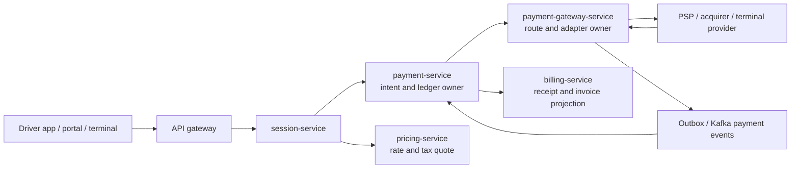
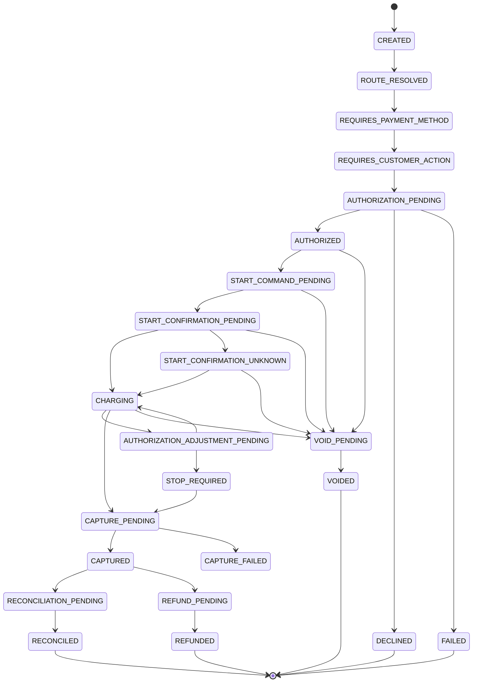
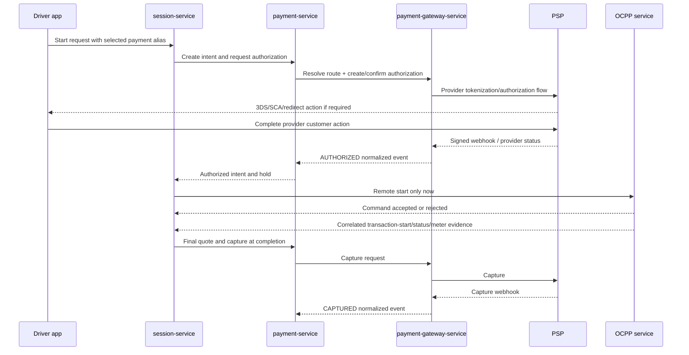
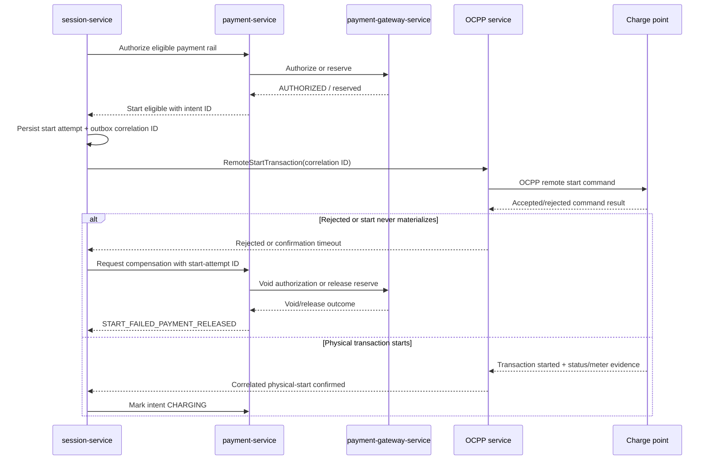

# Production Payment Gateway Architecture

Status: Implementation in progress; live provider activation is intentionally blocked pending tokenization, a selected PSP sandbox, and deployment infrastructure.

Date: 2026-07-21

Scope: `payment-service`, a new `payment-gateway-service`, `session-service`,
`pricing-service`, `billing-service`, API gateway, mobile applications, Driver
Portal, Admin Portal, simulator, and platform operations.

Related document:
`docs/requests/2026-07-20-regional-payment-settlement-plan/README.md`

## 1. Purpose

Design a production-grade, configuration-driven payment platform for charging
sessions. It must allow a system administrator to configure supported payment
providers, merchants, countries, currencies, capabilities, sandbox/live
environments, and routing rules without changing ordinary charging code.

The architecture must support:

- Direct driver card payments, stored cards, wallet-funded sessions, and
  physical card-terminal payments.
- Pre-authorization, authorization adjustment where a provider supports it,
  capture, partial capture, void, refund, inquiry, webhooks, reconciliation,
  and CPO settlement reporting.
- Charging-country pricing and tax in the charger currency.
- Cross-border card use while preserving the CPO's required settlement
  currency.
- Country-specific payment methods and provider constraints.
- Sandbox validation without real funds.
- Safe failure when no qualified payment route exists.
- Strict secret isolation, PCI scope reduction, data-level RBAC, auditable
  configuration changes, and operational recovery.

This is a technical architecture. It does not grant a payment, money
transmitter, payment-institution, e-money, tax, or merchant-of-record licence.
Production activation in every country remains subject to a CPO agreement,
provider onboarding, and qualified legal/tax review.

## 2. Architecture Decisions

### AD-01: Split Financial Domain From Provider Integration

Create a new **payment-gateway-service**. It owns provider adapters, routing,
provider configuration metadata, secret references, signed webhook ingress,
provider operation idempotency, and provider settlement/report retrieval.

Keep **payment-service** as the financial domain service. It owns payment
intents, wallet reservations, ledger entries, payment method aliases, payment
state, public ElectraHub transaction IDs, and the final internal financial
record.



Why a separate service:

- PSP SDKs, credentials, webhooks, certificates, provider-specific retry
  rules, and terminal integrations are isolated from wallet and session logic.
- Provider integration can evolve independently without contaminating charging
  orchestration with gateway-specific concepts.
- Secrets and outbound network permissions can be restricted to one service.
- A provider outage or adapter deploy does not require changing the core
  financial ledger model.

The split must not create a distributed transaction. `payment-service` records
the intent and an outbox event atomically. `payment-gateway-service` performs
the external action with a stable idempotency key. Provider results return
synchronously where a decision is immediately required and asynchronously by
verified webhook/event for canonical completion.

### AD-02: Charging Price, Settlement Currency, And Card Statement Currency

Three concepts are independent and must be stored separately:

| Concept | Meaning | Authority |
| --- | --- | --- |
| `charging_currency` | Currency of the tariff, taxes, fees, and driver amount for the charger location. | Pricing/tax policy for the charger location. |
| `merchant_settlement_currency` | Currency in which the selected CPO merchant account receives settlement from its PSP/acquirer. | CPO merchant account and PSP configuration. |
| `driver_statement_currency` | Currency eventually shown by the driver's card issuer. | Issuer/card network; unknown to ElectraHub unless the PSP explicitly provides a disclosure. |

Example: a Canadian charger is rated in `CAD`. A US-issued card can be
authorized for the CAD presentment amount. The Canadian CPO receives CAD only
if the selected provider route and merchant settlement profile support CAD. The
US card issuer may convert the CAD charge to USD for the driver statement. That
issuer conversion is not ElectraHub revenue, tax, or a price-plan amount.

Do not infer, calculate, or promise the driver statement conversion. Do not
silently select a route that settles the CPO in USD when its merchant settlement
profile requires CAD. A route that cannot meet the required settlement currency
must be rejected before charging starts.

Dynamic Currency Conversion is a separate, highly regulated/card-network
feature. It is disabled in the first release. It can only be added later through
the selected PSP's supported flow, explicit driver consent, and country/legal
review.

### AD-03: Provider Adapters Are Plug-In, Not Magic

Adding a new CPO, country, merchant account, currency, or sandbox/live route
must be configuration-only **when an adapter already exists**. Adding a new
PSP still requires a small, isolated Java adapter, provider contract tests,
security review, and production approval. Provider APIs, settlement models,
token scopes, authentication mechanisms, and webhook semantics cannot be made
safe through arbitrary JSON configuration alone.

The initial adapter set is:

| Adapter | Initial purpose | Important capability constraints |
| --- | --- | --- |
| `MOCK` | Deterministic regression, simulator, and JMeter validation. | Never moves money and cannot be enabled for production CPO routes. |
| `STRIPE` | US/EU card-not-present, tokenized mobile/web flow, later Connect platform option. | Manual capture and settlement/FX capabilities are account/product dependent. |
| `MOLLIE` | Netherlands/EU CPO direct-merchant pilot. | Manual capture is method dependent; Mollie documents no incremental authorization extension. |
| `ADYEN` | Later enterprise and unified online/terminal capability. | Pre-authorization/adjustment depends on acquired method, merchant settings, issuer, and webhook handling. |
| `RAZORPAY` | India card/UPI/local payment evaluation. | Capture behavior, currency, merchant, and settlement capabilities are provider/account specific. |
| `TWO_C2P` | Later Southeast Asia country-specific evaluation. | Each country/payment method requires explicit commercial/capability validation. |

No adapter is a promise that every country, card brand, payment method, CPO, or
settlement currency is supported. The route capability check is authoritative.

### AD-04: Fail Closed Before OCPP Start

Before `session-service` submits an OCPP remote start, it must obtain a
financial authorization result appropriate to the payment rail. If the route
is missing, disabled, unvalidated, unhealthy, lacks the required capability,
or does not support the charging/settlement currency combination, the charging
request fails with a deterministic error.

```text
PAYMENT_ROUTE_NOT_CONFIGURED
PAYMENT_ROUTE_DISABLED
PAYMENT_CURRENCY_NOT_SUPPORTED
MERCHANT_SETTLEMENT_CURRENCY_UNSUPPORTED
PAYMENT_METHOD_NOT_SUPPORTED
PAYMENT_PROVIDER_UNAVAILABLE
PAYMENT_AUTHORIZATION_DECLINED
PAYMENT_CUSTOMER_ACTION_REQUIRED
```

There is no production default fallback to another provider after a financial
authorization has been created. The selected provider, merchant account, and
route are pinned to the payment intent. A fallback is allowed only before a
customer payment method has been committed and only when the route policy says
the alternate provider is compatible.

### AD-05: Pricing, Tax, And Surcharge Are Separate From Gateway Fees

The driver amount is constructed server-side as:

```text
energy + time + parking + idle + session/reservation fees
- eligible subscription discount
+ customer-visible payment surcharge, only when allowed
+ tax calculated from the applicable tax policy
= driver presentment total in charging_currency
```

The provider/acquirer fee, platform application fee, chargeback fee, FX fee,
and CPO payout fee are **not** driver tariff line items. They are commercial
settlement costs and are recorded separately from the driver receipt unless a
lawful, disclosed, customer-visible surcharge policy explicitly permits a
charge to the driver.

`pricing-service` owns tariff rating and tax/surcharge quote construction.
`payment-service` consumes an immutable final quote and must never re-rate a
session. `billing-service` projects the rated and paid snapshot into a receipt
or invoice; it does not recalculate money.

## 3. Current-State Audit

### Existing Strengths

- `session-service` already asks `payment-service` for a start authorization
  and settlement through `PaymentEligibilityClient` and
  `PaymentSettlementClient`.
- `pricing-service` has pricing plan currency, tariff components, session caps,
  and idle-fee caps.
- Session service resolves charger tariff currency before starting a session and
  blocks wallet cross-currency use.
- The current service layout supports a clean `session-service ->
  payment-service -> payment-gateway-service` boundary.

### Blocking Gaps

| Area | Observed current state | Production requirement |
| --- | --- | --- |
| Card storage | `AddCardRequest` accepts a raw 16-digit card number. | Provider-hosted/mobile/terminal tokenization; no PAN/CVV reaches ElectraHub. |
| Card authorization | A CARD authorization succeeds when a local card exists. | Real provider authorization or payment intent confirmation. |
| Settlement | Card settlement is local bookkeeping. | Provider capture/inquiry/webhook result drives financial status. |
| Card-present | `CardPresentPaymentService` uses `DUMMY_CARD_PRESENT` and accepts PAN/CVV. | Certified terminal or PSP terminal SDK/reference only. |
| Gateway abstraction | Existing document is a design draft; no implemented provider SPI or routing engine. | New gateway service and capability-based adapters. |
| Tax | Billing invoice creation sets tax to zero; pricing does not have a complete jurisdiction tax policy. | Versioned tax quote/finalization and immutable tax lines. |
| Surcharges | No country/card/network policy or driver disclosure logic. | Policy engine, legality/capability checks, consent, and tax treatment. |
| Currency | BigDecimal/local currency values are used without a canonical minor-unit model. | ISO 4217 minor units, rounding policy, currency metadata, and separate presentment/settlement fields. |
| Reconciliation | No provider settlement/payout report ingestion or exception workflow. | Daily reconciliation, payout visibility, and auditable exception management. |
| Admin control plane | No payment gateway configuration page exists. | System-admin-only configuration, status, route, health, and audit screens. |

The current raw-card and dummy terminal APIs are sandbox/demo-only liabilities.
They must be removed or disabled before any production provider route is
enabled.

## 4. Service Ownership

| Service | Owns | Must not own |
| --- | --- | --- |
| `session-service` | Charging lifecycle, OCPP coordination, charging stop policy, frozen session link to payment intent. | PSP credentials, card tokens, gateway routing, tax recalculation. |
| `pricing-service` | Price plan, tariff components, subscription discount inputs, tax/surcharge policies, rated quotation, final rated snapshot. | PSP capture or merchant settlement. |
| `payment-service` | Payment intent, wallet reserve, financial ledger, payment method aliases, financial state machine, public EHB payment ID, receipt payment projection. | Provider API keys, provider webhook verification, terminal SDK details. |
| `payment-gateway-service` | Provider adapters, route resolution, merchant/provider configuration metadata, secret references, capability discovery, webhook ingress, provider operation log, reconciliation import. | Wallet balance, subscription discount, charger rating, receipt content. |
| `billing-service` | Invoice/receipt projection, CDR/analytics export from immutable rated and paid facts. | Re-rating, gateway calls, or payment decisions. |
| `subscription-service` | Entitlement and discount allocation. | Payment capture and tax/legal policy. |
| API gateway | End-user/service authentication, route exposure, rate limits, trace correlation. | Provider credentials and payment business rules. |
| Admin Portal | Authorized configuration and operational views. | Secret display, direct provider calls, final financial state transitions. |

## 5. Canonical Money, Tax, And Payment Model

### 5.1 Money

Use a shared Java value type across service contracts:

```java
public record Money(long amountMinor, String currency) {
    // currency is ISO 4217 uppercase; the currency metadata supplies exponent.
}
```

Pricing calculations may use `BigDecimal` for energy, time, and tax
intermediate precision. Every customer-facing or provider-facing monetary line
is rounded exactly once by the applicable policy and persisted as `Money`.

Required attributes on each rated/payment record:

```text
amount_minor
currency
currency_exponent
rounding_mode
rounding_rule_version
```

This removes the unsafe assumption that all currencies have two decimal places.

### 5.2 Rated Charge Snapshot

At session start, `pricing-service` returns a **start estimate and reserve
policy**, not an invented final price. At session completion/unplug, it returns
an immutable `FinalChargeQuote`:

```text
quote_id
pricing_snapshot_id
tax_snapshot_id
surcharge_policy_snapshot_id
charging_currency
location_country
merchant_of_record_id
line_items[]
  - ENERGY, TIME, PARKING, IDLE, SESSION_FEE, RESERVATION
  - SUBSCRIPTION_DISCOUNT
  - PAYMENT_SURCHARGE
  - TAX
subtotal_minor
discount_total_minor
surcharge_total_minor
tax_total_minor
grand_total_minor
maximum_session_total_minor
authorization_reserve_minor
```

The quote includes the tax jurisdiction, taxable basis per line, rate/type,
inclusive/exclusive treatment, and rounding decisions. Session service stores
the quote reference and only asks payment service to capture the quote's final
total.

### 5.3 Tax Policy

Add a tax-policy module to `pricing-service`, initially internal and
configuration-driven. Do not create an extra tax microservice until there is an
actual external tax-provider or scale requirement.

`tax_profile` is scoped by CPO/network/location and includes:

```text
effective_from / effective_to
country / state-province / municipality / postal or tax-zone selector
tax_registration_reference (masked display only)
tax_inclusion_mode: INCLUSIVE | EXCLUSIVE
tax_categories for energy, time, idle, parking, session fee, surcharge
rounding rule and invoice rule version
external_tax_provider reference, optional future extension
```

Tax is calculated from the charger location and merchant/tax profile, not the
driver's home country. Tax policy must be effective-dated, versioned, and
snapshotted. Price changes and tax changes cannot modify an active or completed
session's original financial basis.

### 5.4 Payment Surcharge Policy

Customer payment surcharge is disabled by default. It can only become available
when all of the following are true:

1. The CPO has explicitly enabled it.
2. The country/state/province/city and payment-network policy permits it.
3. The selected provider and payment method expose the necessary card/product
   information and support the expected display flow.
4. The policy is within legal, network, merchant-contract, and provider limits.
5. The driver receives the exact amount and reason before authorization.
6. Tax treatment of the surcharge has been included in the final tax quote.

The policy model contains:

```text
mode: DISABLED | COST_OF_ACCEPTANCE | FIXED | PERCENTAGE
scope: country, subregion, merchant, network, location, payment method, card class
max_minor / max_percent
calculation_basis: subtotal_before_tax | subtotal_after_tax
tax_category
disclosure_template_version
effective dates
legal_review_reference
```

The policy engine must not use an acquirer fee estimate as an automatic customer
fee. It returns a rejected/unavailable result if data is insufficient. The EU
launch defaults to `DISABLED`: PSD2 prohibits retailers from surcharging for
certain consumer card payments. US/Canada/Asia routes remain disabled until a
country and merchant-specific review has approved their policy.

## 6. Provider Configuration Control Plane

### 6.1 Configuration Entities

```text
gateway_provider
  provider_code: MOCK | STRIPE | MOLLIE | ADYEN | RAZORPAY | TWO_C2P
  adapter_version
  configuration_json_schema
  supported_capabilities
  status

gateway_connection
  id, provider_code, environment: SANDBOX | PRODUCTION
  safe_configuration_json
  credential_secret_reference
  webhook_secret_reference
  certificate_secret_reference
  endpoint_profile
  status: DRAFT | VALIDATING | READY | ACTIVE | DISABLED | RETIRED
  validated_at, last_health_at, last_error_code

merchant_payment_account
  id, cpo/network/enterprise scope
  legal_entity_reference
  provider_connection_id
  provider_merchant_reference
  merchant_country
  merchant_of_record_mode
  settlement_profile_id
  supported_presentment_currencies
  required_settlement_currencies
  onboarding_status
  capability_snapshot

payment_route
  id, priority, enabled, effective dates
  merchant_payment_account_id
  charging_country, subregion optional
  presentment_currency
  settlement_currency
  channel, payment_method_type
  required_capabilities
  fallback_route_id only for pre-commit routing

gateway_capability_override
  provider/connection/merchant specific
  supports_manual_capture, incremental_authorization, partial_capture,
  multi_capture, void, refund, card_present, 3ds_sca, local_methods,
  settlement_reports, payout_reports

payment_surcharge_policy
tax_profile
tax_rule
```

Credentials never appear in `safe_configuration_json`. The only secret-related
information returned by an admin API is state such as:

```text
credential_configured: true
credential_last_rotated_at: 2026-07-21T00:00:00Z
webhook_secret_configured: true
certificate_configured: false
```

System administrators can see which provider connection and credential type is
configured for a country/merchant. They must never see API keys, private keys,
webhook secrets, tokens, or driver payment method tokens. Customer payment
tokens are not configuration and must never be listed in admin UI.

### 6.2 Configuration Lifecycle

```mermaid
stateDiagram-v2
    [*] --> DRAFT
    DRAFT --> VALIDATING: validate schema and secret references
    VALIDATING --> READY: provider validation succeeds
    VALIDATING --> DRAFT: validation fails
    READY --> ACTIVE: approved activation
    ACTIVE --> DISABLED: emergency disable
    DISABLED --> READY: remediation and validation
    ACTIVE --> RETIRED: no new routes; existing intents drained
    RETIRED --> [*]
```



Rules:

- A production route references only an `ACTIVE` production connection and an
  approved merchant account.
- Sandbox routes reference only sandbox connections.
- A route configuration change creates a new version. Existing payment intents
  remain pinned to their original connection and route snapshot.
- A production credential rotation is dual-read/validate first, then activated
  through an audited change.
- Retire a connection only after no pending authorization, capture, refund,
  dispute, or reconciliation operation references it.
- `MOCK` is allowed only in local/test/demo environments and denied by
  production admission policy.

### 6.3 Cache And Performance

`payment-gateway-service` resolves a route from an immutable configuration
snapshot cached in Redis and in-process memory. Recommended cache key:

```text
gateway-route:{merchantAccountId}:{chargingCountry}:{presentmentCurrency}:{channel}:{paymentMethod}
```

- Default TTL: 10 minutes.
- Invalidate immediately through an outbox event and Redis pub/sub when a
  gateway, merchant account, route, capability, or tax/surcharge policy is
  changed.
- Every cache value includes a configuration version. A request rejects a stale
  or missing value rather than applying a route that has been disabled.
- Secrets are resolved by reference from the approved secret store and cached
  only in the gateway service for the provider SDK's shortest safe lifetime.
- Existing intents use their persisted route snapshot and do not query the
  route cache to capture/refund a payment.

## 7. Java Design

### 7.1 Module Layout

```text
payment-gateway-service/
  gateway-api/                 gRPC/HTTP internal contracts and webhook ingress
  gateway-core/                routing, capabilities, operation orchestrator
  gateway-config/              control-plane entities, schema validation, audit
  gateway-security/            secret resolver, webhook verification, redaction
  gateway-adapter-spi/         provider-neutral interfaces and DTOs
  gateway-adapters-mock/
  gateway-adapters-stripe/
  gateway-adapters-mollie/
  gateway-adapters-adyen/
  gateway-adapters-razorpay/
  gateway-adapters-2c2p/
  gateway-reconciliation/      report import, payout matching, exceptions
```

`payment-service` gains:

```text
payment-intent domain
payment-attempt domain
authorization-hold domain
wallet-reservation bridge
ledger/outbox consumers
payment-method alias/binding domain
financial state machine
```

### 7.2 Adapter SPI

```java
public interface PaymentGatewayAdapter {
    GatewayProvider provider();
    GatewayCapabilitySet capabilities(GatewayContext context);

    CheckoutSession createCheckoutSession(CreateCheckoutSessionCommand command);
    AuthorizationResult authorize(AuthorizeCommand command);
    AuthorizationResult adjustAuthorization(AdjustAuthorizationCommand command);
    CaptureResult capture(CaptureCommand command);
    VoidResult voidAuthorization(VoidCommand command);
    RefundResult refund(RefundCommand command);
    PaymentStatusResult getStatus(StatusQuery query);

    VerifiedWebhook verifyAndParseWebhook(WebhookRequest request);
    SettlementReportPage retrieveSettlementReport(SettlementReportQuery query);
    PayoutReportPage retrievePayoutReport(PayoutReportQuery query);
}
```

The SPI uses canonical commands with:

```text
payment_intent_id
payment_attempt_id
operation_id
idempotency_key
merchant_account_snapshot
route_snapshot
Money presentment_amount
Money required_settlement_amount
payment method/token reference
return/callback URLs
driver consent/disclosure evidence reference
trace_id
```

An adapter must return `UNSUPPORTED_CAPABILITY` instead of attempting an
unsafe approximation. For example, a provider that cannot increment an
authorization cannot be used for a policy that requires it.

### 7.3 Core Components

| Component | Responsibility |
| --- | --- |
| `PaymentRouteResolver` | Finds one valid route from a versioned snapshot. |
| `CapabilityPolicyEvaluator` | Verifies authorization, capture, currency, payment method, terminal, and reporting capabilities. |
| `GatewayOperationOrchestrator` | Executes an idempotent provider operation and records provider interaction state. |
| `PaymentGatewayRegistry` | Resolves installed adapter by provider code/version. |
| `MerchantAccountResolver` | Resolves CPO legal entity, merchant reference, settlement profile, and route scope. |
| `SecretResolver` | Retrieves named credentials without putting them in logs, DB rows, or DTOs. |
| `WebhookIngressService` | Verifies provider signature, deduplicates event ID, stores event, and emits a normalized event. |
| `GatewayReconciliationService` | Imports settlement/payout records and creates exceptions. |
| `GatewayHealthService` | Tests configured connection safely and tracks health/circuit breaker state. |
| `PaymentIntentService` | In payment-service, owns financial state and ledger transition. |
| `ChargeQuoteValidator` | Ensures final charge/tax/surcharge quote matches intent currency and cap policy. |

### 7.4 Provider-Specific Mapping

Provider API field names stay inside the adapter. Examples:

| Canonical action | Stripe adapter | Mollie adapter | Adyen adapter | Razorpay adapter |
| --- | --- | --- | --- | --- |
| Authorize/hold | PaymentIntent manual capture | Payment `captureMode=manual` where method supports it | PreAuth payment/terminal request | Provider authorized payment/order flow where configured |
| Adjust hold | Provider capability check | Unsupported for incremental extension | Authorization adjustment if allowed | Usually use configured capture rules, no generic adjustment assumption |
| Capture | PaymentIntent capture | Capture endpoint | Capture modification | Capture authorized payment |
| Release/void | Cancel PaymentIntent | Release authorization | Cancel/void per provider state | Void/refund model per provider capability |
| Callback | Signed webhook | Payment/capture webhook | Standard notification webhook | Webhook/signature verification |

The row is a mapping guide, not a universal contract. Every adapter declares
its actual configuration-scoped capability set at runtime.

## 8. Payment Intent And State Machine

### 8.1 Core Records

```text
payment_intent
  id, public_transaction_id, session_id, driver_account_id nullable
  settlement_rail: DIRECT_CARD | WALLET | CARD_PRESENT | ROAMING_EMSP
  payment_method_type
  charging_currency, presentment_currency, merchant_settlement_currency
  merchant_account_snapshot_id, route_snapshot_id
  quote_id, original_authorization_minor, final_charge_minor
  start_attempt_id, financial_start_status, early_failure_policy_snapshot_id
  status, created_at, updated_at

payment_attempt
  id, intent_id, operation_type, sequence, idempotency_key
  gateway_provider, gateway_connection_snapshot_id
  provider_operation_reference encrypted/limited access
  request_amount_minor, response_amount_minor, currency
  status, failure_code, provider_status, timestamps

authorization_hold
  id, intent_id, provider_reference, authorized_money, current_authorized_money
  capturable_money, expires_at, adjustment_count, state

charging_start_attempt
  id, intent_id, session_id, charger_id, connector_id
  ocpp_command_correlation_id, ocpp_transaction_reference nullable
  command_status, physical_start_status, confirmation_deadline_at
  first_meter_at nullable, first_meter_wh nullable, terminal_reason nullable
  compensation_state, created_at, updated_at

payment_recovery_action
  id, intent_id, start_attempt_id nullable
  action_type: VOID_AUTHORIZATION | RELEASE_WALLET_RESERVE | REFUND_CAPTURE |
               STOP_AND_RECONCILE | PROVIDER_INQUIRY
  reason_code, idempotency_key, provider_reference nullable
  status, requested_at, completed_at nullable, failure_detail_safe

payment_refund
  id, intent_id, original_capture_attempt_id, recovery_action_id
  amount_minor, tax_minor, currency, reason_code
  provider_refund_reference, status, created_at, completed_at nullable

financial_ledger_entry
  id, intent_id, entry_type, Money, account/scope, source_attempt_id
  immutable audit metadata, created_at

payment_method_alias
  id, driver_account_id, display_brand, last4, expiry metadata
  consent_version, status

provider_payment_method_binding
  alias_id, provider, platform/merchant scope, provider_customer_reference,
  provider_payment_method_reference, capability snapshot, status
```

A card stored for one provider/merchant scope is not automatically valid for
another CPO, provider, country, or connected account. The gateway service may
create a provider-approved binding/clone only when the provider supports that
model and the driver's consent covers it. Otherwise the application asks the
driver to add or authenticate a payment method for the newly selected route.

### 8.2 State Machine



`session-service` can move the physical session to `ACTIVE` only after payment
intent is `AUTHORIZED` or the selected rail's equivalent eligible state.

`START_COMMAND_PENDING`, `START_CONFIRMATION_PENDING`, and
`START_CONFIRMATION_UNKNOWN` are persisted financial orchestration states, not
user-facing charging states. A positive OCPP remote-start command response is
not treated as proof that energy delivery started. `CHARGING` requires the
correlated physical-start evidence defined in section 9.2.1.

Capture confirmation may be asynchronous. A completed charging receipt can
show `PAYMENT_PROCESSING` while the provider capture is pending. It must never
claim a payment is settled merely because a local record was written.

## 9. Charging Flow

### 9.1 Preflight On Connector Detail

When a driver opens a connector, the app requests a read-only payment
eligibility/preflight response. This enables a precise UX before the Start
button is pressed:

```text
charger/connector identity
charging country and charging currency
eligible payment rails and provider-supported payment methods
merchant settlement currency requirement
estimated reserve amount and cap
tax inclusion/exclusion display
possible surcharge policy: disabled / disclosed quote required
reason each unavailable payment method is unavailable
```

The response contains no secret, provider private key, or reusable card token.

### 9.2 Card-On-File Or New Card



If the provider returns `REQUIRES_CUSTOMER_ACTION`, the app completes the
provider's hosted SDK/browser flow and resumes using the same intent. It does
not create another charging session or a second authorization.

### 9.2.1 Financial Authorization, Physical Start, And Compensation

Do **not** invert the sequence to start energy delivery before a financial
eligibility decision. A successful OCPP remote-start response generally means
the charge point accepted a command; it is not proof that a transaction started,
the cable remained connected, or energy was delivered. Starting first would
create unrecoverable exposure when the driver has insufficient funds, the card
is declined, a payment method requires SCA, or the provider is unavailable.

For an upfront card-funded charging rail, the selected route must explicitly
support separate authorization and capture, or another approved equivalent
reservation model. A provider/method that auto-captures and cannot safely
reverse or reconcile the result is not eligible for this flow; route resolution
must fail before the OCPP command rather than silently charging first.

The required model is a compensating saga, with separate financial and physical
states:

```text
1. Freeze a price/tax/surcharge/cap quote and resolve the payment route.
2. Authorize the card, reserve wallet funds, or obtain the selected rail's
   equivalent eligible result. Do not send OCPP remote start unless eligible.
3. Persist charging_start_attempt and an outbox command with a stable
   correlation ID before sending the OCPP command.
4. Receive command acceptance/rejection, but keep the intent in
   START_CONFIRMATION_PENDING.
5. Correlate an actual transaction-start event plus connector status and, where
   available, the first valid meter value. Only then mark physical start
   confirmed and continue charging.
6. If start is rejected, times out, or is verified not to have begun, run the
   idempotent compensation action: void/release an uncaptured card hold or
   release the wallet reservation.
7. If payment was already captured by provider behavior or a race, create an
   idempotent refund instead of trying to void an already captured payment.
```



The OCPP correlation is immutable and must include the session, charge point,
connector, command correlation ID, and transaction reference once available.
The existing connector Redis state is a fast correlation aid, not the financial
source of truth. `charging_start_attempt` and the transactional outbox remain
the recovery source after a Redis eviction, pod restart, or delayed event.

#### Start Confirmation Timeout And Unknown State

`start_confirmation_timeout_seconds` is a versioned operational policy, scoped
to the charger/network capability rather than hard-coded in the mobile app. The
initial pilot value should be calibrated between 90 and 180 seconds; the current
five-minute generic start-attempt timeout is a fallback only and must not be
used as evidence that charging failed.

Before releasing money at timeout, `session-service` must make a bounded,
correlated state inquiry using the OCPP transaction state, connector state, and
known meter/session facts:

| Observation | Required action |
| --- | --- |
| Command rejected and no transaction start | Void/release immediately. |
| Command accepted, no start event, connector definitively available/no transaction | Void/release immediately. |
| Transaction start or positive meter evidence appears late | Mark `CHARGING`; do not release the financial authorization. |
| State cannot be proven because of a transport or charger outage | Mark `START_CONFIRMATION_UNKNOWN`, retry bounded inquiry, and do not blindly release. If physical start is later proved, send controlled stop if financial coverage is no longer valid, then rate and reconcile. |
| Provider request timed out | Query the provider with the original idempotency key before retrying, releasing, or sending a second OCPP command. |

This avoids the dangerous race where the platform releases a hold after an
apparent timeout while the charger begins a delayed session. All compensation
actions are keyed by `payment_intent_id`, `start_attempt_id`, and a stable
operation idempotency key.

### 9.2.2 Early Hardware Failure, Release, And Refund Policy

An early hardware failure is not the same as a driver-initiated cancellation.
The policy is frozen on the payment intent and should be configurable at the
price-plan/merchant policy level, with a stricter connector override only where
contractually required:

```text
start_confirmation_timeout_seconds
early_failure_grace_seconds
minimum_billable_energy_wh
hardware_fault_waiver_enabled
waive_session_fee_on_early_hardware_fault
waive_time_fee_on_early_hardware_fault
refund_reason_policy_version
```

`early_failure_grace_seconds` may initially be configured as 60 seconds, but it
is not a universal refund rule. The outcome depends on verified charger facts,
metered energy, tariff disclosure, and the failure cause:

| Scenario | Financial result |
| --- | --- |
| Card/wallet eligibility fails before remote start | No OCPP start command; no hold/reservation. |
| Charger rejects remote start or never physically starts | Full void of the uncaptured authorization or release of the wallet reservation. No refund record, no charge, and no session fee. |
| Physical start, hardware/OCPP fault within the grace period, zero billable energy | Default policy: void/release the uncaptured reserve and waive charging, time, and session fees. If a capture already occurred, create a full refund and credit note. |
| Physical start, hardware fault after some billable energy | Capture only the server-rated delivered-energy/allowed tariff amount and automatically release the remainder. A merchant may configure an additional goodwill waiver, but it must be explicit and auditable. |
| Driver stops or unplugs after a valid start | Apply the disclosed tariff to actual billable consumption; do not grant an automatic hardware-fault waiver. |
| Provider auto-captured or capture/webhook races with a release action | Query provider state; refund captured money or release only the still-uncaptured amount. Never issue both for the same amount. |

The driver-facing status distinguishes a hold from a refund:

- **Authorization released**: no money was captured. ElectraHub has canceled
  the authorization/reservation; the issuer may still show a pending entry until
  its own release window completes.
- **Refund pending/completed**: money was captured. ElectraHub has created an
  idempotent refund, recorded a credit ledger entry and tax correction/credit
  note, and waits for provider confirmation.
- **Payment investigation required**: physical and provider state remain
  ambiguous. The session is not represented as paid or refunded until the
  reconciliation worker resolves it.

For wallet-funded sessions, an unsuccessful start releases the wallet reserve
atomically. A later refund after wallet settlement is a new immutable credit
entry; it is not a mutation of the original debit. For card-present, terminal
and PSP states decide whether to cancel a pre-authorization or refund a captured
payment. For PnC/RFID roaming, the equivalent correction is a CDR/contract
credit workflow rather than an assumption that a retail-card refund exists.

### 9.3 Authorization Reserve And Charging Cap

`pricing-service` determines an authorization reserve policy from the frozen
price/tax/surcharge policy. A safe first policy is:

```text
reserve = min(
  maximum permitted session total including tax and permitted surcharge,
  provider/merchant configured authorization ceiling
)
```

The maximum includes session charging cap and max idle-fee cap. It must not be
derived from a stale UI estimate.

During charging:

1. Session service recalculates the server-side running quote after metering.
2. At a configurable threshold below available authorization, it requests an
   adjustment only if the route advertises `INCREMENTAL_AUTHORIZATION`.
3. The provider result must be confirmed before the old hold is exceeded.
4. If adjustment is unsupported, declined, times out, or the authorization is
   nearing expiry, the backend sends a controlled OCPP stop before exposure
   exceeds the safe authorized amount.
5. The final capture amount is never greater than provider-confirmed capturable
   amount unless the chosen provider explicitly supports a configured
   over-capture policy and the CPO/legal policy permits it.
6. If the physical session ends before any billable delivery, the early-failure
   compensation policy in section 9.2.2 decides whether to void/release or
   refund. A UI timer or a local app estimate must never make that decision.

Provider differences matter. Stripe supports manual capture on eligible payment
methods. Mollie documents manual capture for supported methods but does not
support authorization-date extension/incremental authorization. Adyen documents
pre-authorization adjustments but notes method, issuer, and merchant
constraints. Razorpay requires capture behavior consistent with its merchant
configuration. The capability gate decides the strategy rather than assuming
all providers behave identically.

### 9.4 Wallet

Wallet remains an internal rail:

1. Wallet eligibility is checked in the charging currency.
2. Payment service atomically reserves available wallet money.
3. Session service runs the same quote/cap monitor.
4. Final quote settles the reservation; unconsumed reserve is released.
5. Auto-top-up is a separate card-funded PSP payment intent. Wallet balance is
   credited only after provider-confirmed capture.

Do not allow implicit wallet currency conversion or cross-border wallet
settlement in the first production release. A user can use an eligible card for
cross-border charging instead.

### 9.5 Card-Present

The terminal, not the simulator or ElectraHub backend, collects PAN/CVV.

```text
Certified terminal -> PSP/acquirer -> terminal result/reference
terminal/HMI -> OCPP/session-service -> payment-service intent
payment-service -> gateway service verifies provider reference -> authorize
```

The simulator may emulate a terminal using declared sandbox payment methods and
synthetic provider token references. It must never accept or retain a real
card number/CVV.

### 9.6 RFID, Plug And Charge, And Roaming

Authorization identity and financial settlement rail are separate:

| Start identity | Typical financial rail |
| --- | --- |
| Driver app / QR | Direct card or wallet. |
| RFID linked to a driver account | Account's configured card/wallet. |
| ISO 15118 Plug and Charge | Contractual eMSP/roaming settlement or an account-backed payment rail. |
| Anonymous physical card terminal | Card-present provider settlement. |

For OCPI roaming/contractual PnC, create a `ROAMING_EMSP` payment intent that
links to the CDR/contract settlement workflow. Do not force it through an
ordinary retail card capture just because an OCPP authorization occurred.

## 10. Cross-Border Rules

1. Charger location determines tariff, tax jurisdiction, `charging_currency`,
   and default `presentment_currency`.
2. The CPO merchant account determines the permitted settlement currency and
   legal merchant context.
3. Driver card country is not the primary routing key. It is an optional
   payment-method/capability signal.
4. A stored payment alias resolves to a provider-specific binding only after
   the route is selected.
5. If a US card is not usable through the Canadian CPO's selected gateway
   account, the app asks for a route-compatible payment method instead of
   pretending the card is globally portable.
6. The customer sees CAD and the Canadian tax/price lines. The issuer may show
   USD later. That issuer FX is external to the receipt unless an approved
   provider DCC disclosure applies.
7. CPO dashboard revenue and payout reports group by settlement currency. A
   multi-currency dashboard does not sum USD and CAD without an explicit
   reporting FX rate, source, timestamp, and disclosure.
8. Gateway configurations are scoped to merchant/legal entity and country.
   System administration alone does not authorize one CPO to use another CPO's
   merchant account.

## 11. Internal APIs And Events

### 11.1 Payment Service To Gateway Service

Use authenticated gRPC for internal latency-sensitive commands; use REST only
where it is more suitable for provider redirects or admin clients.

```text
ResolvePaymentRoute(PreflightRequest) -> PaymentRouteDecision
CreateCheckoutSession(CreateCheckoutSessionRequest) -> CheckoutSession
AuthorizePayment(AuthorizePaymentRequest) -> AuthorizationDecision
AdjustAuthorization(AdjustAuthorizationRequest) -> AdjustmentDecision
CapturePayment(CapturePaymentRequest) -> CaptureDecision
VoidAuthorization(VoidAuthorizationRequest) -> VoidDecision
RefundPayment(RefundPaymentRequest) -> RefundDecision
QueryPaymentStatus(QueryPaymentStatusRequest) -> PaymentStatus
```

Every write command includes:

```text
payment_intent_id
operation_id
idempotency_key
route_snapshot_id
trace_id
request_timestamp
```

### 11.2 Gateway Events

```text
payment.gateway.authorization.authorized.v1
payment.gateway.authorization.declined.v1
payment.gateway.authorization.action-required.v1
payment.gateway.authorization.adjusted.v1
payment.gateway.authorization.expired.v1
payment.gateway.capture.succeeded.v1
payment.gateway.capture.failed.v1
payment.gateway.void.requested.v1
payment.gateway.void.succeeded.v1
payment.gateway.void.failed.v1
payment.gateway.refund.requested.v1
payment.gateway.refund.succeeded.v1
payment.gateway.refund.failed.v1
charging.start.command.rejected.v1
charging.start.confirmed.v1
charging.start.confirmation-timeout.v1
charging.early-failure.detected.v1
payment.gateway.webhook.failed.v1
payment.gateway.reconciliation.exception.v1
payment.gateway.payout.reported.v1
```

Events contain canonical identifiers, amounts, currencies, gateway/provider
metadata safe for internal access, and trace IDs. They never contain PAN, CVV,
full provider secret values, or raw sensitive webhook payloads.

### 11.3 Webhook Ingress

```text
POST /api/v1/gateway/webhooks/{provider}/{connectionId}
```

The gateway service:

1. Resolves the active/retired connection for the endpoint.
2. Verifies signature, timestamp, certificate, and source requirements defined
   by the adapter.
3. Deduplicates by provider event ID and payload hash.
4. Persists the raw encrypted/limited-access payload and normalized event in one
   durable operation.
5. Returns the provider-required acknowledgement only after durable acceptance.
6. Processes the normalized event asynchronously and publishes it through the
   outbox.

Webhook failure, duplicate delivery, out-of-order delivery, and provider retry
must not create a second capture or change an already final ledger entry.

## 12. System Administration And Admin Portal

### 12.1 New System-Admin Navigation

Add a `Payments` section visible only to `SYSTEM_ADMIN`:

```text
Payments
  Gateway Providers
  Gateway Connections
  Merchant Accounts
  Payment Routes
  Tax Profiles
  Surcharge Policies
  Payment Operations
  Reconciliation
  Payouts
  Configuration Audit
```

Network/enterprise/location administrators see only their scoped CPO merchant
accounts, payment route status, payment operations, receipt data, and
reconciliation/payout information as permitted by the data-level RBAC model.
They never see platform-wide routes or secrets.

### 12.2 Gateway Connection Screen

Show:

- Provider, adapter version, environment, endpoint profile.
- Country/currency/payment-method/capability summary.
- Credential status, webhook status, certificate status, last validated, last
  health status, and last safe error code.
- Linked merchant accounts and active routes.
- Version history, approval state, activation/retirement state, and audit
  history.

Do not show:

- Secret key, API key, webhook signing secret, certificate private key,
  access token, card token, provider customer ID, PAN, or CVV.

### 12.3 Configuration Workflow

1. System admin creates a draft gateway connection using safe provider fields.
2. An infrastructure secret is created separately in the approved vault.
3. System admin references the secret by name and submits validation.
4. Gateway service validates schema, secret availability, provider reachability,
   provider account/capability response, and currency/method selection.
5. A privileged approver activates the production route. For sandbox, a single
   system-admin activation is sufficient.
6. Each action creates an immutable audit event with before/after safe values,
   actor, scope, correlation ID, timestamp, and approval reference.

Production activation and destructive operations require two-person approval
when an operational approver role is available. This may be feature-flagged for
the demo environment but is required by the target architecture.

## 13. Security, Reliability, And Performance

### Security

- No raw PAN/CVV in any ElectraHub request, database table, Kafka message,
  cache, log, trace, error response, simulator form, or test fixture.
- Use hosted fields, provider mobile SDKs, hosted checkout, or certified
  terminals for card data collection.
- `payment-gateway-service` has the only outbound credentials for PSP APIs.
- Store credential references, not credential values, in PostgreSQL.
- Apply workload identity/mTLS or signed service credentials between session,
  payment, and gateway services.
- Verify webhook signatures and protect against replay.
- Redact PII/payment fields in logs and traces; apply least-privilege database
  and admin permissions.
- Treat provider customer IDs and payment tokens as pseudonymous personal data
  with retention/deletion/audit rules.

### Reliability

- Use idempotency keys at every internal and provider mutation boundary.
- Use a transactional outbox instead of distributed database/provider
  transactions.
- Apply connection pools, timeout budgets, circuit breakers, and bounded retry
  policies. Never retry a non-idempotent provider charge without a stable key.
- Use provider inquiry/webhook recovery rather than assuming an HTTP timeout
  means a payment failed.
- Maintain a dead-letter queue for normalization/reconciliation failures and a
  human-operable exception queue.
- Run a compensating-action worker for rejected, timed-out, and early-failed
  starts. It must query the provider and the correlated charger state before
  deciding between void, refund, or controlled stop-and-reconcile.
- Record a release/void as pending until the provider result or signed webhook
  confirms it. Do not tell a driver that funds are instantly available again;
  the issuer can display an authorization for longer than the PSP action.
- Reconcile all `START_CONFIRMATION_UNKNOWN`, `VOID_PENDING`, `REFUND_PENDING`,
  and capture-after-fault cases until they reach a terminal state or a staffed
  exception queue.
- Maintain a capture-before-expiry job driven by each authorization's provider
  `expires_at`, not a static global duration.
- Keep retired provider connections accessible for capture, void, refund, and
  reconciliation of existing intents until drained.

### Performance

- Resolve route and capability from a versioned Redis cache, not multi-table
  joins on each charging operation.
- Persist the route/merchant capability snapshot on intent creation; avoid
  configuration reads during capture or refund.
- Keep live authorization call paths short: session -> payment -> gateway ->
  provider. UI tokenization goes directly to the provider SDK where possible.
- Register the OCPP start correlation before publishing the remote-start outbox
  command. Use one bounded connector/session lookup on timeout, not polling
  every service or repeatedly querying the PSP from the request thread.
- Persist compensation state before invoking a provider. Redis may accelerate
  connector lookup and deduplication, but PostgreSQL plus outbox is the durable
  source for payment recovery.
- Run reconciliation, report import, retry recovery, and analytics
  asynchronously.
- Emit low-cardinality metrics. Do not use driver/card/provider transaction IDs
  as metric labels.
- Track p50/p95/p99 route resolution, authorization, adjustment, capture,
  webhook lag, and reconciliation latency by provider/country/method.
- Track authorization-to-physical-start latency, start failures after
  authorization, stale holds, void/refund completion latency, early hardware
  fault rate by charger/firmware, and capture failures after delivered energy.

## 14. Tax, Surcharge, And Fee Acceptance Tests

| Scenario | Expected result |
| --- | --- |
| Canada charger, Canadian CPO settlement, US card | CAD tariff and tax quote; CAD merchant settlement route; issuer FX remains external. |
| Canada charger, only USD merchant settlement route | Start denied with `MERCHANT_SETTLEMENT_CURRENCY_UNSUPPORTED`. |
| EU consumer card and surcharge disabled policy | No surcharge line, regardless of estimated PSP fee. |
| Permitted US merchant surcharge route | Exact disclosed surcharge appears before authorization and in tax quote/receipt. |
| Provider fee changes after capture | CPO payout/reconciliation changes; driver receipt remains unchanged unless the explicit surcharge was part of original quote. |
| Tax rate changes during an active session | Start snapshot/final policy rules apply deterministically and are recorded; no retroactive mutation. |
| Subscription discount | Discount policy is applied before tax/surcharge according to the configured jurisdiction rule and is visible as a separate line. |
| Card authorized, OCPP remote start rejected | Exactly one authorization void/release; no charging session, capture, session fee, or refund record. |
| OCPP accepted but no physical start by confirmation deadline | Bounded correlated inquiry, then exactly one void/release only when no transaction is proven. |
| Late transaction start after timeout | No blind release; mark unknown, reconcile physical state, then rate or controlled-stop before any financial compensation. |
| Hardware fault within early-failure grace, zero billable energy | Full uncaptured hold release; if capture raced, exactly one full refund and credit note. |
| Hardware fault after metered delivery | Capture only the immutable backend-rated amount; release unused reserve and apply configured waiver only when eligible. |
| Driver cancels a valid session | Rate actual consumption under tariff; no automatic hardware-fault refund. |
| Duplicate OCPP event, retry, or webhook | One start attempt, one compensation/capture/refund per idempotency key. |
| Wallet reserve on failed start | Atomic reserve release with no negative balance or duplicate credit. |
| Card-present preauthorization/capture | Adapter chooses cancel before capture or refund after capture; terminal never exposes PAN/CVV to ElectraHub. |
| Session reaches cap | Server stops or holds according to cap/reserve policy; no UI-side business calculation. |

## 15. Migration Plan

### Phase 0: Decisions And Guardrails

1. Confirm CPO direct-merchant model for first live pilot.
2. Choose one first market and one first provider adapter. Netherlands/EU with
   Mollie or Stripe sandbox is the recommended initial path.
3. Confirm the initial payment rail set: wallet, card-not-present, and later
   card-present. Treat PnC/roaming as separate settlement rails.
4. Define CPO merchant account, settlement currency, refund/chargeback, fee,
   tax, and support contracts.
5. Obtain country-specific legal/tax/payments review before enabling production
   money movement.

### Phase 1: Financial Model And Security Refactor

1. Add canonical money/currency utilities and schema migrations.
2. Add payment intent, attempt, hold, ledger, payment alias/binding, and route
   snapshot records.
3. Replace raw card DTOs and disable dummy card-present APIs in production.
4. Preserve historic masked card display/receipt data but mark legacy cards as
   non-usable until re-tokenized through a provider.
5. Move receipt payment status to the payment-intent state rather than current
   local settlement flag.

### Phase 2: Gateway Service And Mock Adapter

1. Create `payment-gateway-service` with configuration control plane, secret
   resolver, adapter SPI, webhook store, and mock adapter.
2. Implement route/capability resolution and hard failure for missing config.
3. Implement idempotent payment operations and normalized events.
4. Add mock scenarios for approval, decline, SCA action, timeout, duplicate
   webhook, delayed capture, capture failure, refund, settlement report, and
   payout report.
5. Add the `charging_start_attempt` and `payment_recovery_action` saga with
   deterministic OCPP correlation, provider inquiry, void/release, and refund
   paths before enabling any real adapter.

### Phase 3: Pricing Tax/Surcharge Contract

1. Add tax profile and surcharge policy models to `pricing-service`.
2. Extend session pricing snapshots and final quotes with line-level tax and
   surcharge detail.
3. Align session caps/idle caps with authorization reserve calculation.
4. Extend billing receipts/invoices and analytics to consume the immutable
   quote, not calculate a separate tax total.

### Phase 4: First Sandbox Provider

1. Implement one provider adapter with hosted/mobile tokenization and manual
   capture support.
2. Build gateway configuration/admin UI, health validation, and audit trail.
3. Verify end-to-end card authorization, 3DS/SCA, capture, void, partial
   capture, provider callback, receipt state, refund, and reconciliation.
4. Use mock gateway for load testing; keep live/sandbox PSP contract tests low
   volume and provider-approved.
5. Exercise rejected start, no-start timeout, late transaction start, early
   charger fault with zero/some metered energy, duplicate event, provider timeout,
   and captured-payment refund paths in contract and regression suites.

### Phase 5: First Controlled Production Pilot

1. Onboard one CPO merchant account with the selected PSP.
2. Configure its country, supported currencies, settlement profile, tax profile,
   routes, and zero/default surcharge policy.
3. Enable a feature flag only for pilot chargers/drivers.
4. Reconcile daily and review exceptions before expanding volume.
5. Enable card-present only after a certified terminal integration is verified.

### Phase 6: Regional And Platform Expansion

1. Add US, India, and Southeast Asia adapters/country records one at a time.
2. Validate each provider's merchant, currency, authorization, capture, refund,
   webhook, report, and settlement capabilities.
3. Add marketplace/connected-account settlement only after separate legal and
   operational approval.
4. Add multi-currency wallet/FX only as a dedicated regulated-product project.

## 16. Definition Of Done

The architecture is ready for a production CPO pilot only when all of the
following are true:

1. No API accepts or stores raw PAN/CVV.
2. A system-admin-configured production route is validated, versioned, audited,
   and secret-safe.
3. A missing, disabled, or unsupported route blocks OCPP start with a clear
   machine-readable error.
4. The selected provider authorization is confirmed before OCPP remote start.
5. Final server-side quote is captured exactly once with provider idempotency.
6. Capture/void/refund/status/webhook flows are fully idempotent and recoverable.
7. A remote-start acknowledgement alone cannot mark a payment intent charging;
   physical-start correlation and durable recovery are verified.
8. Failed or early-fault sessions void/release uncaptured holds, while captured
   funds use an idempotent refund and credit-note path.
9. Driver-initiated cancellation is distinguishable from verified charger fault
   in the immutable rating and compensation policy.
10. Charging currency, CPO settlement currency, and driver statement currency
   are modelled separately.
11. Tax/surcharge lines are rate-versioned, disclosed where allowed, and
   immutable on the receipt.
12. Payment receipts show a safe ElectraHub transaction ID, not provider/acquirer
   secret/internal identifiers.
13. Daily reconciliation demonstrates provider transactions and payout records
    match the internal ledger or appear as an accountable exception.
14. System admin sees configuration health and audit data without seeing any
    secret or driver token.
15. JMeter regression runs through the mock gateway and provider sandbox tests
    pass for the selected adapter.

## 17. Open Decisions

1. Which first live provider should be chosen for the Netherlands pilot:
   Mollie or Stripe?
2. Is the first pilot CPO a direct merchant, with ElectraHub charging a separate
   SaaS fee? This document recommends yes.
3. Is physical card-present required in the first live pilot? If yes, choose
   terminal hardware/provider before implementation begins.
4. Which exact charging countries/currencies are in first scope?
5. Should tax be configured manually for the first pilot or delegated to an
   external tax provider after the internal versioned tax module is stable?
6. Which CPO role can see settlement reports and reconciliation exceptions?
7. Should platform application fees be enabled only after a marketplace model is
   legally approved?

## 18. Official Research Notes

- Stripe manual authorization/capture and hold lifecycle:
  https://docs.stripe.com/payments/place-a-hold-on-a-payment-method
- Stripe refund API and partial-refund semantics:
  https://docs.stripe.com/api/refunds/create
- Stripe Terminal cancel-before-capture versus refund-after-capture:
  https://docs.stripe.com/terminal/features/refunds
- Stripe Connect currencies and presentment/settlement FX:
  https://docs.stripe.com/connect/currencies
- Stripe connected-account payment method use:
  https://docs.stripe.com/connect/direct-charges-multiple-accounts
- Mollie manual capture, hold expiry, and lack of incremental authorization
  extension: https://docs.mollie.com/docs/place-a-hold-for-a-payment
- Adyen pre-authorization and adjustment constraints:
  https://docs.adyen.com/online-payments/adjust-authorisation/adjust-with-preauth/
- Adyen cancel-before-capture and refund-after-capture behavior:
  https://docs.adyen.com/online-payments/cancel
  https://docs.adyen.com/online-payments/refund/
- Razorpay capture API:
  https://razorpay.com/docs/api/payments/capture/
- European Commission payment-services overview and card surcharge ban context:
  https://finance.ec.europa.eu/consumer-finance-and-payments/payment-services/payment-services_en
- Visa US/Canada surcharge disclosures and rules:
  https://www.visa.com/en-us/support/visa-rules
- De Nederlandsche Bank platform/PSD2 considerations:
  https://www.dnb.nl/en/sector-information/open-book-supervision/laws-and-eu-regulations/psd2/electronic-trading-platforms-e-commerce-platforms-under-psd2/
- FinCEN money-services-business guidance:
  https://www.fincen.gov/resources/money-services-business-msb-registration
- RBI cross-border payment-aggregator notification:
  https://rbi.org.in/Scripts/NotificationUser.aspx/upload/Scripts/NotificationUser.aspx?Id=12561

## 19. Status

Planned on 2026-07-21. This work changes no payment code, credentials, gateway
configuration, or production funds movement.
